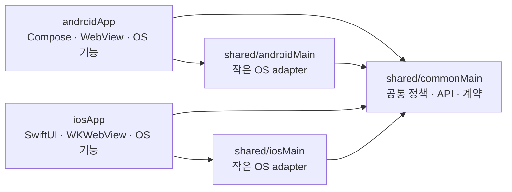

# KLAS+ 아키텍처

KLAS+는 KMP 공통 코어 위에 Android Compose와 iOS SwiftUI 앱을 얹습니다. 대부분의 화면은 별도 배포되는 [WebView 웹 앱](https://github.com/IceCream0910/kw-klas-plus-webview)이 맡아요.

## 모듈과 의존 방향

| 모듈 | 소유권 |
|---|---|
| `shared/commonMain` | Ktor API/DTO, 인증·세션·도메인 정책, repository/use case, 플랫폼 중립 상태, URL·브리지 명령/이벤트 모델과 port |
| `shared/androidMain`, `shared/iosMain` | HTTP engine, 저장소·암호화·쿠키 및 UI 수명주기와 무관한 작은 OS adapter |
| `androidApp` | Compose/Activity, Android WebView holder, QR·PIP·위젯·파일·생체인식 등의 앱/화면 adapter |
| `iosApp` | SwiftUI/WKWebView holder, WidgetKit, 파일·카메라·LocalAuthentication 및 앱 수명주기 |

`commonMain`에는 `Context`, `Activity`, `WebView`, `UIViewController`, `WKWebView`, Compose·SwiftUI 타입을 넣지 마세요. 공통 의미는 port/result로 표현하고, 화면이나 WebView 수명주기에 묶인 구현은 각 앱에 둡니다. 큰 OS 기능을 무조건 `expect/actual`로 만들 필요도 없어요.

## 인증·세션·저장소

로그인 순서와 오류 결과는 공통 `KlasHttpAuthDriver`가 다루고, HTTP/RSA 실행은 플랫폼 adapter가 맡습니다. `SessionLeaseManager`는 서버 `/session/info`로 세션 만료와 연장을 판단해요. 명시적으로 만료됐을 때만 SESSION을 지우고, 일시적인 네트워크·서버 오류라면 보존한 뒤 재시도합니다. 저장소와 WebView cookie의 동기화 순서는 `SessionCoordinator`가 맡습니다.

암호화 비밀번호, SESSION, 도서관 키, 앱 잠금 hash/salt는 비밀로 다뤄주세요. Android 비밀은 Keystore 보호 저장소에, iOS 비밀은 Keychain에 둡니다. SESSION 원문은 일반 preferences에 새로 기록하지 않고 보안 저장소와 WebView cookie만 동기화합니다. iOS 17 캘린더 위젯 새로고침은 App Group 파일이 아니라 Keychain Access Group `$(AppIdentifierPrefix)com.icecream.kwklasplus.academic-session`에서 `SESSION_TOKEN`과 서버 암호화 KLAS 비밀번호만 메인 앱과 공유합니다. 앱 잠금 hash/salt와 도서관 비밀은 앱 전용 Keychain에 남기고, 확장은 WKWebView cookie를 만들지 않습니다. 확장 재인증 뒤에는 App Group의 cookie 동기화 필요 표시를 메인 앱이 `SessionCoordinator.restore()`로 소비합니다. 비밀 저장 파일은 백업·기기 이전에서 제외해요. 평문 비밀번호는 저장하거나 로그에 남기지 마세요. 앱 잠금(PIN·생체인식) 설정은 기기 설정이므로 로그아웃 후에도 유지합니다.

### 인증과 세션에서 지킬 동작

| 상황 | 동작 |
|---|---|
| 저장 정보가 없거나 수동 로그인을 요청함 | ID/PW를 받아 서버 암호화 API에 전달하고, 평문은 저장하지 않아요. |
| 저장된 자격증명으로 로그인 | 양 플랫폼이 공통 `KlasHttpAuthDriver`의 `LoginSecurity` → `LoginCaptcha` → `LoginConfirm` 순서를 사용해요. CAPTCHA·임시 비밀번호·추가 인증은 사용자 조치로 분리합니다. |
| 저장 SESSION으로 시작하거나 새 SESSION을 관찰함 | 서버 유효성을 확인하고 `SessionCoordinator`가 세션 저장소·WebView cookie·관찰 시각을 맞춥니다. Cookie 이름은 `SESSION`, 도메인은 `.kw.ac.kr`, 경로는 `/`이며 `Secure; HttpOnly`입니다. |
| 서버가 세션 만료를 명시함 | 세션과 cookie를 지운 뒤 재인증 경로로 돌아갑니다. 네트워크 오류·timeout·서버 오류만으로는 비밀을 지우지 않아요. |
| 로그아웃·계정 변경 | 세션·cookie·계정 자격증명을 정책대로 정리하되 기기 잠금 설정은 유지합니다. |

정확한 상태 전이는 [`AuthStateMachine`](../shared/src/commonMain/kotlin/com/icecream/kwklasplus/core/auth/AuthStateMachine.kt), HTTP 순서는 [`KlasHttpAuthDriver`](../shared/src/commonMain/kotlin/com/icecream/kwklasplus/core/auth/KlasHttpAuthDriver.kt), 저장소·cookie 동기화는 [`SessionCoordinator`](../shared/src/commonMain/kotlin/com/icecream/kwklasplus/core/session/SessionCoordinator.kt)가 기준입니다.

### 보존할 저장 키

키 이름은 기존 설치 데이터와 연결돼 있어요. 새 모델을 도입해도 이름·의미를 임의로 바꾸지 마세요.

| 용도 | 기존 키 |
|---|---|
| 계정·자격증명 | `kwID`, `kwPWD` |
| 세션 | `kwSESSION`(기존 설치 이전 전용), `kwSESSION_timestamp` |
| 일반 설정 | `appTheme`, `yearHakgi`, `yearHakgiList` |
| 도서관 | `library_stdNumber`, `library_phone`, `library_password`, `library_secure_prefs/secret_*`, `library_secure_prefs/authKey_*` |
| 앱 잠금 | `a_l_e`, `b_m_e`, `p_w_h`, `p_w_s` |

`kwPWD`·SESSION 토큰·도서관 비밀번호/키·잠금 hash/salt는 비밀로, `kwSESSION_timestamp`와 일반 설정은 분리해 저장합니다. 기존 Android 버전의 일반 sharedPreference에 저장된 `kwSESSION` 값은 공통 세션 API가 업그레이드 때 한 번 읽어 보안 저장소에 기록하고 재조회로 검증한 뒤 삭제합니다. 이때 `kwSESSION_timestamp`는 보안 세션에서도 쓰므로 유지합니다. 이전·검증에 실패하면 원문을 남겨 다음 시작에서 재시도하고, 보안 저장소 읽기에 실패하면 평문 fallback을 사용하지 않습니다. 새 세션은 일반 preferences에 미러링하지 않으며 `HomeActivity`의 네 읽기 경로도 공통 세션 API를 사용합니다. 로그아웃은 보안 세션과 잔존 `kwSESSION`을 모두 지웁니다. 롤백 시 구버전 앱이 새로 발급된 세션을 일반 preferences에서 읽을 수 없으므로 재로그인이 필요할 수 있습니다. 기존 키 이름은 [`LegacyPreferenceKeys`](../shared/src/commonMain/kotlin/com/icecream/kwklasplus/core/legacy/LegacyContracts.kt)에 있습니다.

## WebView·Native 브리지

웹은 `KlasNativeBridge.*`를 호출하고 Bridge v1 `KlasNativeBridgeNative.postMessage`로 앱과 통신합니다. 구 Android 앱용 `window.Android` fallback은 [웹 adapter](https://github.com/IceCream0910/kw-klas-plus-webview)에만 있어요. 각 앱의 WebView holder는 생성·이동·폐기를 맡고, 공통 router는 HTTPS origin, main frame, 허용 메서드, 인자·크기·URL을 검증합니다. Bridge는 검증된 도메인(KLAS+ webview 페이지, 학교 공식 페이지)에서만 작동하도록 되어있습니다. JS 값은 JSON으로 직렬화하고 비밀은 로그에 남기지 마세요.

웹과 앱은 따로 배포됩니다. 브리지 이름·인자·callback이나 저장 키를 바꾸려면 양쪽 계약 테스트, 구버전 호환 경로, 롤백을 함께 준비해 주세요. 아래 현행 계약은 코드·계약 테스트와 함께 갱신합니다. [마이그레이션 패리티 기록](kmp-migration/feature_parity_matrix.md)은 당시 기능 상태를 확인할 때만 참고하세요.

### Bridge v1 요청과 검증

웹 요청은 `{"version":1,"id":"...","method":"openPage","arguments":["..."]}` 형태입니다. 응답은 같은 `version`·`id`와 `ok`, `result` 또는 `error.code`를 돌려줘요. `id`는 비어 있으면 안 되고 최대 128자, payload는 UTF-8 기준 최대 64 KiB입니다. 인자 목록·타입은 surface별 카탈로그와 일치해야 합니다.

일반 surface는 `https://klas.kw.ac.kr` 또는 `https://klasplus.yuntae.in`의 정확한 origin과 main frame만 허용합니다. Video surface는 추가로 HTTPS `*.kw.ac.kr`을 허용하지만 루트 `kw.ac.kr`, 사용자 정보·포트가 붙은 URL은 허용하지 않아요. 알 수 없는 메서드와 잘못된 인자·origin은 거부합니다. [`BridgeValidator`](../shared/src/commonMain/kotlin/com/icecream/kwklasplus/core/bridge/BridgeValidator.kt)와 [`BridgeJsonCodec`](../shared/src/commonMain/kotlin/com/icecream/kwklasplus/core/bridge/BridgeJsonCodec.kt)이 검증 기준입니다.

### Web → Native 메서드

현재 카탈로그는 7개 surface, 57개 명령입니다. 아래 이름은 공개 계약이므로 오타처럼 보이는 `evaluteKLASScript`도 바꾸지 마세요. 정확한 인자 개수·타입은 [`LegacyBridgeCatalog`](../shared/src/commonMain/kotlin/com/icecream/kwklasplus/core/bridge/LegacyBridgeCatalog.kt), typed 대응은 [`BridgeMethodId`](../shared/src/commonMain/kotlin/com/icecream/kwklasplus/core/bridge/BridgeMethodId.kt)가 기준입니다.

| Surface | 메서드 |
|---|---|
| Home | `changeTab`, `evaluate`, `openPage`, `openExternalPage`, `completePageLoad`, `openLibraryQR`, `openLibraryQRSettingsModal`, `openLectureActivity`, `qrCheckIn`, `openDateTimePicker`, `openWebViewBottomSheet`, `closeWebViewBottomSheet`, `openOptionsMenu`, `openYearHakgiBottomSheet`, `reload`, `performHapticFeedback`, `requestIdCardQRValue` |
| Lecture | `completePageLoad`, `openPage`, `getBoardPath`, `openBoardList`, `openBoardView`, `openExternalLink`, `evaluteKLASScript`, `openOnlineLecture`, `openLecturePlan`, `openQRScan` |
| Board | `openPage`, `openExternalLink`, `completePageLoad` |
| Lecture plan | `completePageLoad`, `openPage`, `openExternalPage` |
| Link | `openPage`, `openLecturePlanPage`, `openWebViewBottomSheet`, `closeWebViewBottomSheet`, `completePageLoad` |
| Video | `completePageLoad`, `openExternalLink`, `openInKLAS`, `requestOnlineLecture`, `receivePlayerStates`, `receiveInitSpeed`, `receiveVideoData`, `receiveVideoURL`, `performHapticFeedback` |
| Settings | `completePageLoad`, `changeAppTheme`, `openYearHakgiSelectModal`, `openLibraryQRSettingsModal`, `openExternalLink`, `performHapticFeedback`, `setAppLockEnabled`, `setAppLockPassword`, `setBiometricEnabled`, `getAppLockSettings` |

### Native → Web callback

아래 이름과 인자 수는 현재 [`LegacyWebCallback`](../shared/src/commonMain/kotlin/com/icecream/kwklasplus/core/web/WebScript.kt)이 지원하는 JS 주입 계약입니다. 각 화면이 실제 호출하는 부분집합은 플랫폼 앱 코드에서 확인해 주세요. `receivedData`는 화면에 따라 2·3·4개 인자를 받고, `onAppLockSettingChanged`는 boolean 또는 설정 JSON 형태를 사용합니다. 토큰·학생증 QR 같은 비밀은 로그에 남기지 마세요.

| 용도 | callback |
|---|---|
| 로그인·세션 | `appLogin.setInitial(3)`, `window.receiveToken(1)` |
| 화면 데이터 | `window.receivedData(2~4)`, `window.receiveTimetableData(1)`, `window.receiveDeadlineData(1)`, `window.receiveIdCardQRValue(2)` |
| 학기·설정 | `window.updateYearHakgiBtnText(1)`, `window.setDateTime(2)`, `window.receiveTheme(1)`, `window.receiveYearHakgi(1)`, `window.receiveVersion(1)`, `window.onAppLockSettingChanged(1)`, `window.onBiometricSettingChanged(1)` |
| 화면 제어 | `window.closeWebViewBottomSheet(0)`, `window.pageReload(0)` |

숫자는 인자 수입니다. `appLogin.setInitial`은 현재 제품의 기본 HTTP 인증이 아니라 보존된 iOS WebView 인증 경로에서 사용하며, `window.pageReload`는 공통 스크립트에 정의돼 있지만 현재 제품 화면의 호출은 확인되지 않았습니다. JS 문자열은 [`LegacyWebScripts`](../shared/src/commonMain/kotlin/com/icecream/kwklasplus/core/web/WebScript.kt)로 이스케이프해요. `window.receiveSubjList`처럼 과거 패리티 표에만 있는 항목은 현행 callback 목록으로 취급하지 않습니다.

## 플랫폼 기능과 ADR

QR 출석, 앱 잠금, PIP, 위젯, 파일·외부 URL은 공통 요청/결과와 OS 실행을 분리합니다.

| 기능 | 플랫폼별 구현·차이 |
|---|---|
| 강의 재생·PIP | Android는 Activity PIP, iOS는 WKWebView HTML5 PIP를 사용합니다. iOS PIP 창의 ±10초 조작은 Android와 같지 않아요. [ADR-001](adr/ADR-001-ios-player-pip.md) |
| 도서관 QR 위젯 | Android·iOS 모두 정적 아이콘에서 앱의 QR 화면을 엽니다. iOS 위젯에는 개인정보를 공유하지 않아요. [ADR-002](adr/ADR-002-ios-library-qr-widget.md) |
| 학사 시간표·캘린더 위젯 | Android 구현은 [ADR-004](adr/ADR-004-android-academic-widgets.md)를 따릅니다. iOS WidgetKit 표시·딥링크는 [ADR-005](adr/ADR-005-ios-academic-widgets.md), iOS 17 캘린더 새로고침은 [ADR-006](adr/ADR-006-ios-widget-interactive-refresh.md)를 따릅니다. iOS 캘린더 새로고침은 SESSION 원문을 App Group에 두지 않고 Keychain Access Group의 SESSION·암호화 비밀번호만 확장과 공유합니다. |

Android 네이티브 화면은 compact(<600dp), medium(600~839dp), expanded(≥840dp)로 나눕니다. WebView 내부 레이아웃은 웹 앱이 맡아요. iOS에서는 safe area·키보드·Dynamic Type·회전 때문에 WKWebView holder를 새로 만들지 않도록 주의해 주세요.
