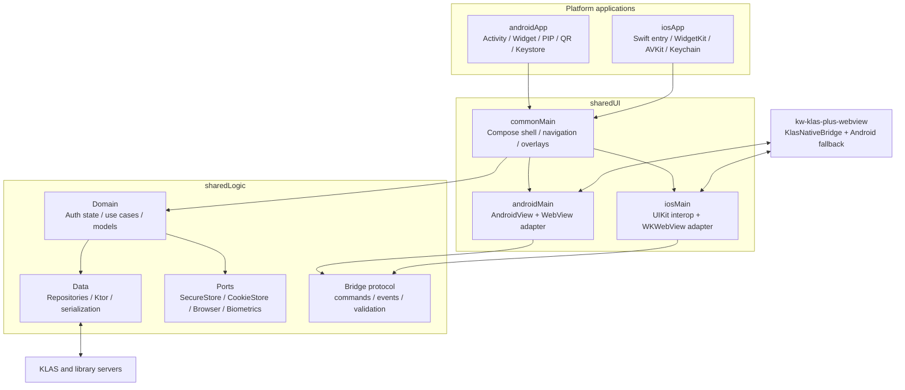

# KLAS+ KMP 전환 아키텍처 및 실행 계획

- 문서 상태: 제안안
- 분석일: 2026-07-15
- 대상: 기존 Android View 앱 → KMP + Compose Multiplatform Android/iOS 앱
- 최우선 성공 조건: 기존 Android 기능과 사용자 데이터의 무회귀 이전

## 1. 결론

이 프로젝트는 전체 재작성보다 **strangler 방식의 점진 이전**이 적합하다. 먼저 기존 Android 앱을 현재 저장소에서 그대로 빌드 가능한 기준선으로 복원하고, 인증·세션·브리지 계약을 테스트로 고정한다. 그 다음 공통 코어를 추출하고, Android 화면을 한 경로씩 Compose로 감싼 뒤 교체한다. Android 패리티가 확보된 공통 코어와 UI만 iOS에서 재사용한다.

권장 목표는 다음과 같다.

- 공통화: 인증 상태 머신, 세션 정책, KLAS API, DTO, 저장소 계약, 브리지 명령/이벤트 모델, Compose 셸과 공통 오버레이 UI
- 플랫폼 유지: 실제 WebView, 쿠키 저장소, 보안 저장소, 생체인식, 앱 잠금 수명주기, QR 스캔, 다운로드/파일 선택, 위젯, PIP
- 호환 전략: 현재 웹의 `window.Android.*` 계약을 먼저 그대로 지원하고, 버전이 있는 `KlasNativeBridge` 프로토콜로 병행 이전
- 릴리스 전략: Android를 각 단계마다 배포 가능한 상태로 유지하고, iOS는 공통 코어가 안정화된 뒤 기능 슬라이스 단위로 추가

## 2. 분석 범위와 근거

### 2.1 현재 로컬 보일러플레이트

현재 작업 폴더는 Git 메타데이터가 없는 KMP 초기 프로젝트이며 다음 모듈이 있다.

| 모듈 | 현재 상태 | 필요한 변화 |
|---|---|---|
| `androidApp` | Compose 샘플, Android application | 기존 앱 기준선 수용, 플랫폼 진입점/기능 소유 |
| `sharedLogic` | Android+iOS 타깃, 인사말 샘플 | 공통 도메인·데이터·계약 구현 |
| `sharedUI` | 이름과 달리 Android 타깃만 있음 | iOS 타깃 및 framework 추가, 공통 Compose 셸 구현 |
| `iosApp` | SwiftUI 샘플, `SharedLogic` 직접 사용 | `SharedUI` Compose 진입점 포함, iOS 플랫폼 구현 연결 |

관찰된 설정 차이도 선행 해결이 필요하다.

- 로컬: AGP 9.0.1, compile/target SDK 36, min SDK 24, JVM 11, 앱 버전 1.0
- 기존 앱: AGP 9.2.1, compile/target SDK 37, min SDK 29, Java/JVM 21, 앱 버전 1.2.0(32)
- 기존 앱의 app id와 namespace는 `com.icecream.kwklasplus`

버전을 기계적으로 어느 한쪽에 맞추지 않는다. 기준 앱을 가져온 뒤 CI·Android Studio·Xcode 호환 조합을 고정하고, 앱 버전/서명/SDK 수준이 배포 앱에서 퇴행하지 않도록 한다.

### 2.2 기존 Android 앱

원본: <https://github.com/IceCream0910/kw-klas-plus>

Manifest와 소스에서 확인한 주요 구성은 다음과 같다.

- 13개 Activity: 시작/자동 로그인, 수동 로그인, 홈, 강의 홈, 강의계획서, 게시판, 과제, 링크, 비디오, QR 출석, 설정, 앱 잠금, 도서관 위젯 표시
- 1개 AppWidgetProvider: 도서관 이용증
- 대부분의 제품 UI: `klasplus.yuntae.in`의 WebView 페이지
- 학교 KLAS UI/데이터 접근: `klas.kw.ac.kr` WebView 및 네이티브 HTTP
- Native ↔ Web: `addJavascriptInterface(..., "Android")`와 `evaluateJavascript`
- 네이티브 기능: 생체인식 앱 잠금, Android PIP, QR 스캔, 다운로드/파일 선택, 홈 화면 위젯, 인앱 업데이트, 외부 앱/브라우저 실행, 햅틱

특히 `HomeActivity` 약 1,673행, `VideoPlayerActivity` 약 920행, `LectureActivity` 약 661행으로 UI, 브리지, 네트워크, 내비게이션, 플랫폼 기능이 한 클래스에 혼재한다. 이 코드를 공통 모듈로 그대로 이동하면 플랫폼 결합만 옮겨갈 뿐이므로 먼저 계약과 상태를 분리해야 한다.

### 2.3 WebView 웹 앱

원본: <https://github.com/IceCream0910/kw-klas-plus-webview>

Next.js 웹 앱이 홈 피드, 시간표, 강의, 캘린더, 성적, 프로필, 설정, 장학, KLAS AI 등의 실질 UI를 제공한다. 다수 파일이 `window.Android`를 직접 호출하며 `_app.js`는 `Android.completePageLoad()` 실패 시 Android 앱 외부 환경으로 판단한다.

따라서 iOS 지원은 WKWebView를 띄우는 것만으로 완료되지 않는다. 최소 하나가 필요하다.

1. iOS에서 `window.Android` 호환 shim을 주입한다.
2. 웹 앱을 플랫폼 중립 `window.KlasNativeBridge`로 바꾸고 Android 구계약 fallback을 유지한다.

권장은 두 방법을 함께 쓰는 것이다. 첫 iOS 프로토타입은 호환 shim으로 빠르게 검증하고, 운영 전에는 웹 저장소에 플랫폼 중립 어댑터를 도입한다.

## 3. 목표 아키텍처



### 3.1 모듈 구조

권장 디렉터리 구조는 현재 모듈을 유지하되 역할을 명확히 하는 형태다.

```text
androidApp/
  src/main/
    kotlin/.../app/                 # Application, MainActivity
    kotlin/.../platform/            # Android capability implementations
    kotlin/.../widget/              # AppWidgetProvider, RemoteViews/Glance 선택
    kotlin/.../video/               # PIP 전용 Activity/controller
    kotlin/.../migration/           # 구 SharedPreferences 데이터 이전

sharedLogic/
  src/commonMain/kotlin/.../
    auth/                            # AuthStateMachine, LoginUseCase
    session/                         # Session, SessionPolicy, SessionRepository
    bridge/                          # versioned command/event schema
    klas/                            # KLAS API repository and DTO
    library/                         # 도서관 QR domain/repository
    settings/                        # 일반 설정 모델
    platform/                        # ports/interfaces only
  src/androidMain/kotlin/.../        # Ktor OkHttp engine, small adapters
  src/iosMain/kotlin/.../            # Ktor Darwin engine, small adapters

sharedUI/
  src/commonMain/kotlin/.../
    app/                             # App root, navigation, theme
    feature/auth/                    # onboarding/login/loading/error
    feature/shell/                   # Web container chrome and overlays
    feature/lock/                    # common lock presentation
    web/                             # WebSurface contract, bridge binding
  src/androidMain/kotlin/.../web/    # WebView host
  src/iosMain/kotlin/.../web/        # WKWebView host

iosApp/
  iosApp/                            # Swift entry and native integrations
  widgetExtension/                   # WidgetKit + App Group
```

### 3.2 iOS framework 구성

현재 `sharedUI`에는 iOS 타깃이 없고 iOS 앱은 `SharedLogic`만 import한다. 목표는 다음 중 하나의 framework만 iOS 앱에 노출하는 것이다.

- 권장: `sharedUI`가 `sharedLogic`에 의존하고 `SharedUI.framework` 하나를 iOS 앱이 사용
- 대안: 단일 `sharedApp` 모듈로 두 모듈을 합침

별도 Kotlin framework 두 개가 같은 공통 코드를 중복 포함하지 않도록 한다. `sharedUI`에 `iosArm64`와 `iosSimulatorArm64` 타깃, `ComposeUIViewController` 진입점, 필요한 export 설정을 추가한다. SwiftUI `UIViewControllerRepresentable`이 이 진입점을 감싼다.

## 4. 핵심 계약

### 4.1 인증 상태 머신

현재 동작을 다음 상태로 명시한다.

```text
ColdStart
  ├─ no credential ─> NeedsCredentials
  ├─ valid cached session ─> Authenticated
  └─ stored credential ─> WebLogin

NeedsCredentials
  └─ POST plaintext password over TLS to SelectScrtyPwd.do
       ├─ success: save server-encrypted password ─> WebLogin
       └─ failure ─> RecoverableError

WebLogin
  └─ load KLAS login page, inject id + encrypted password
       ├─ SESSION cookie observed ─> persist session ─> Authenticated
       ├─ CAPTCHA/temp password ─> UserActionRequired
       └─ timeout/network/server failure ─> RecoverableError

Authenticated
  ├─ WebView: cookie store contains SESSION
  ├─ Native HTTP: Cookie: SESSION=<token>
  └─ unauthorized/session expiry ─> WebLogin
```

구현 원칙:

- 상태 전이는 `sharedLogic`에서 순수하게 테스트한다.
- 실제 로그인 페이지 제어와 쿠키 관찰은 `WebAuthDriver` 플랫폼 구현이 맡는다.
- `CredentialStore`, `SessionStore`, `WebCookieStore`, `Clock`, `KlasAuthApi`를 주입한다.
- 세션의 1시간 로컬 캐시 정책은 기존 호환 기본값으로 시작하되 서버 401/로그인 리다이렉트가 최종 진실이다.
- 앱 시작 시 WebView 쿠키와 네이티브 세션 저장소를 한 방향으로만 우연히 복사하지 않는다. 명시적인 `SessionCoordinator`가 갱신·삭제·타임스탬프를 함께 처리한다.
- 로그아웃/계정 변경 시 일반 세션, WebView cookie, localStorage의 토큰, 보안 자격증명을 정책에 따라 원자적으로 삭제한다.

### 4.2 플랫폼 저장소 분류

| 데이터 | 분류 | Android | iOS |
|---|---|---|---|
| 학번, 테마, 학기, UI 설정 | 일반 설정 | SharedPreferences/DataStore adapter | UserDefaults adapter |
| 서버 암호화 KLAS 비밀번호 | 비밀 | Keystore 보호 SecureStore | Keychain |
| `SESSION` 및 타임스탬프 | 비밀/세션 | SecureStore + CookieManager | Keychain + WKHTTPCookieStore |
| 도서관 비밀번호, secret, authKey | 비밀 | Keystore 보호 SecureStore | Keychain |
| 앱 잠금 hash/salt/flags | 비밀 설정 | Keystore 보호 SecureStore | Keychain |
| Widget 표시용 최소 데이터 | 공유 캐시 | 위젯 접근 가능한 앱 내부 저장소 | App Group UserDefaults/파일, 비밀 원문 금지 |

기존 Android의 `EncryptedSharedPreferences`는 AndroidX에서 deprecated 상태다. 신규 구현은 Keystore로 키를 보호하는 자체 `SecureStore` 또는 검증된 대안을 사용하되, 기존 파일을 먼저 읽어 신규 저장소에 기록하고 검증한 뒤 구 키를 삭제한다. 앱 백업/복원에서 키가 없는 암호문이 복원되지 않도록 backup rule을 함께 검증한다.

### 4.3 네트워크

`sharedLogic`의 공통 네트워크 계층은 Ktor Client + kotlinx.serialization을 우선 후보로 한다.

- Android engine: OkHttp
- iOS engine: Darwin/NSURLSession
- 공통 처리: content type, timeout 정책, DTO, 오류 매핑, 세션 헤더, 민감정보 redaction
- 플랫폼 처리: engine/TLS 설정, User-Agent, 네트워크 진단

현재 직접 Thread/OkHttp/JSONObject로 구현된 KLAS 출석 API와 도서관 API부터 작은 repository로 추출한다. WebView에서만 가능한 DOM 스크래핑·페이지 조작은 HTTP repository처럼 위장하지 말고 `WebAutomationPort`로 구분한다.

### 4.4 WebView와 쿠키

공통 `WebSurfaceController`가 다음 의미를 정의한다.

- load/reload/back/forward
- evaluate JSON-safe script
- 현재 URL과 로딩 상태
- 파일 선택, 다운로드, 새 창, 외부 URL 요청 이벤트
- 브리지 command 수신과 callback 전달
- cookie set/get/clear 및 session observation

플랫폼 구현:

- Android: `android.webkit.WebView`, `CookieManager`, `WebViewClient`, `WebChromeClient`
- iOS: `WKWebView`, `WKWebsiteDataStore.httpCookieStore`, `WKNavigationDelegate`, `WKUIDelegate`, `WKScriptMessageHandler`

WebView 인스턴스를 화면 재구성 때마다 만들지 않는다. 화면 수명주기와 분리된 holder/controller로 유지하고, 명시적인 dispose에서 브리지 handler와 delegate를 해제해 누수와 중복 콜백을 막는다.

### 4.5 버전형 JavaScript 브리지

첫 단계에는 기존 `window.Android` API를 그대로 제공한다. 동시에 다음 envelope를 갖는 새 프로토콜을 도입한다.

```json
{
  "version": 1,
  "id": "request-id",
  "method": "openPage",
  "args": { "url": "https://..." }
}
```

응답/이벤트도 JSON envelope로 통일한다.

```json
{
  "version": 1,
  "id": "request-id",
  "ok": true,
  "result": {}
}
```

원칙:

- 메서드 문자열은 sealed command로 파싱하고 알 수 없는 명령을 거부한다.
- origin, main-frame 여부, URL scheme, 인자 타입/길이를 검증한다.
- Native → JS는 `evaluateJavascript("...${value}...")` 문자열 결합 대신 직렬화한 envelope 하나만 전달한다.
- 웹에는 `KlasNativeBridge.call(method, args): Promise`를 제공한다.
- Android 구버전 호환 어댑터는 Promise 호출을 기존 `Android.*`와 callback 함수로 변환한다.
- iOS는 document start에 shim을 주입해 `WKScriptMessageHandler`로 전달한다.
- 동기 반환을 기대하는 `getAppLockSettings()`는 초기 상태를 document start에 주입하거나 async API로 변경한다. 웹과 Android가 함께 배포되기 전에는 기존 동기 메서드를 유지한다.
- 브리지 스키마와 웹 사용처는 CI에서 대조한다.

## 5. 플랫폼 기능 소유권

| 기능 | 공통에 둘 것 | Android 구현 | iOS 구현 |
|---|---|---|---|
| 앱 잠금 | 정책, 상태, UI 상태 | lifecycle + BiometricPrompt | scene phase + LocalAuthentication |
| 비밀번호 잠금 | 검증 유스케이스 | Keystore-backed hash/salt | Keychain-backed hash/salt |
| QR 출석 | payload/결과/HTTP | Google code scanner | AVFoundation/VisionKit 후보 spike |
| 도서관 QR | API/파싱/캐시 정책 | 위젯 갱신, QR bitmap | WidgetKit timeline, SwiftUI QR |
| 강의 PIP | 플레이어 명령/상태 | PictureInPictureParams | AVPictureInPictureController/WK media spike |
| 다운로드 | 요청 모델/정책 | DownloadManager/SAF | URLSession/share sheet/files |
| 파일 선택 | 요청/결과 모델 | Activity Result API | UIDocumentPicker/Photos picker |
| 외부 링크 | URL 정책 | Intent | UIApplication/openURL |
| 햅틱 | 의미 enum | HapticFeedback | UIImpact/Notification feedback |
| 인앱 업데이트 | capability | Play Core | 해당 없음; App Store 정책/버전 안내 |
| 테마/방향/태블릿 | 공통 preference | Android window/orientation | iOS trait/orientation 정책 |

플랫폼에 기능이 없을 때 조용히 무시하지 않는다. `Supported`, `Unavailable(reason)`, `PermissionRequired` 같은 capability 결과를 공통 UI에 전달한다.

## 6. Android 마이그레이션 전략

### 6.1 기준선 복원

현재 샘플 `androidApp`을 곧바로 새 구현으로 채우기 전에 원본 Android 소스를 동일 저장소에서 빌드 가능하게 만든다. 두 선택지 중 첫 번째를 권장한다.

1. `androidApp`에 원본 앱을 가져오고 Compose를 병행 활성화
2. 임시 `legacyAndroidApp` 모듈을 추가하고 새 `androidApp`과 나란히 비교

동일 applicationId를 동시에 설치할 수 없으므로 비교용 flavor/applicationId suffix를 사용한다. 배포 서명과 versionCode는 운영 flavor만 기존 값을 잇는다.

### 6.2 전환 순서

Android는 위험이 낮고 경계가 뚜렷한 순서로 바꾼다.

1. 상수/DTO/오류 타입/세션 정책 추출
2. KLAS 출석 및 도서관 API repository 추출
3. 시작/로그인 상태 머신 추출, 기존 View UI에 연결
4. 공통 브리지 router 도입, 기존 `@JavascriptInterface`가 router에 위임
5. Compose 앱 셸과 내비게이션 도입
6. 로그인/로딩/오류/설정 네이티브 오버레이를 Compose로 교체
7. Home/Lecture/Board/Task/Link WebView host를 공통 패턴으로 통합
8. QR, 다운로드, 잠금, 위젯, PIP를 새 port에 연결
9. 사용되지 않는 Activity/View/XML을 기능별로 삭제

WebView 콘텐츠를 Compose 네이티브 화면으로 재작성하는 것은 이번 범위가 아니다. Compose는 WebView 컨테이너와 네이티브 표면을 담당한다.

## 7. iOS 확장 전략

iOS는 Android 전환 완료를 기다려 한 번에 만들지 않고, 공통 계약이 안정된 슬라이스부터 병행한다.

1. `sharedUI` iOS framework와 빈 Compose 셸
2. WKWebView + origin 제한 + `window.Android` 호환 shim
3. 수동 로그인 → 웹 로그인 → SESSION 추출 → 앱 재시작 세션 복구
4. 홈/시간표/프로필 등 읽기 중심 WebView 경로
5. 외부 링크, modal, 파일 다운로드/선택
6. 설정, 앱 잠금, 생체인식, Keychain
7. QR 출석
8. 비디오/PIP
9. WidgetKit 도서관 이용증

iOS WidgetKit과 PIP는 앱 본체와 별도의 extension/entitlement/실기기 검증이 필요하므로 마지막에 몰아넣지 말고 초기에 기술 spike를 수행한다. 다만 spike 코드는 운영 경로에 바로 합치지 않는다.

## 8. 테스트 전략과 릴리스 게이트

### 8.1 테스트 층

- 계약 테스트
  - 모든 브리지 메서드/인자/콜백 스냅샷
  - AppPrefs 구키 → 신규 모델 매핑
  - URL/origin allowlist
- 공통 단위 테스트
  - 인증 상태 전이, session TTL, 오류 매핑, repository
  - 고정 Clock/Fake SecureStore/Ktor MockEngine 사용
- 플랫폼 통합 테스트
  - Android WebView CookieManager ↔ SecureStore
  - iOS WKHTTPCookieStore ↔ Keychain
  - JS shim 요청/응답, navigation, back 처리
- UI 테스트
  - Compose 로그인/오류/잠금/권한 상태
  - Android 기존 스크린샷 및 동작 비교
- 실기기 테스트
  - 생체인식, QR 카메라, PIP, 위젯, 파일 다운로드, 프로세스 종료/복원
- Web 저장소 테스트
  - 브리지 미존재 브라우저 fallback
  - Android legacy adapter와 새 Promise adapter

### 8.2 Android 패리티 게이트

각 기능은 다음을 모두 만족해야 신규 경로를 기본값으로 켠다.

- 기능 패리티 매트릭스의 Android 기준 시나리오 통과
- 기존 사용자 데이터로 업그레이드 성공
- 세션/자격증명/쿠키 손실 없음
- crash-free/로그인 성공률/페이지 로드 오류율 관측 가능
- 원격 또는 로컬 feature flag로 구 경로 복귀 가능

### 8.3 iOS 베타 게이트

- 지원 OS 최소 버전 확정
- 로그인과 세션 복구 반복 테스트
- 모든 브리지 호출의 미지원 기능 처리
- ATS, 도메인, 개인정보 manifest/권한 문구 검토
- Keychain 접근성 등급과 백업/기기 이전 정책 확정
- Widget/PIP/background 동작 실기기 검증

## 9. 보안 및 안정성 개선 항목

패리티를 깨지 않는 범위에서 다음을 마이그레이션 게이트로 다룬다.

| 관찰 | 위험 | 조치 |
|---|---|---|
| credential을 JS 문자열에 직접 삽입 | 따옴표/escape 문제, script injection | JSON 직렬화 envelope 사용 |
| `addJavascriptInterface`가 WebView에 광범위 노출 | 외부 페이지가 native 기능 호출 가능 | trusted origin/main frame에서만 bridge 연결 |
| `usesCleartextTraffic=true` | 불필요한 평문 트래픽 허용 | endpoint 조사 후 false 및 예외 최소화 |
| 여러 Activity가 CookieManager 직접 조작 | 세션 불일치/삭제 누락 | SessionCoordinator 단일 소유 |
| 세션을 일반 preferences에 저장 | 토큰 노출 위험 | SecureStore로 이전 |
| deprecated EncryptedSharedPreferences | 장기 유지/백업 문제 | Keystore 기반 신규 store + 데이터 이전 |
| 앱 잠금 SHA-256 단일 반복 | 오프라인 추측 비용 낮음 | 호환 이전 계획 후 검증된 KDF 검토 |
| `allowBackup=true`와 비밀 파일 | 복원 후 키 불일치/비밀 정책 불명확 | backup rules에서 비밀 제외 및 복원 테스트 |
| 일부 WebView Activity `exported=true` | 검증되지 않은 Intent/URL 주입 | exported 필요성 제거 또는 strict validation |
| 민감 WebView 화면의 Sentry screenshot | 자격증명/개인정보 캡처 | 화면/필드 masking 및 첨부 정책 검토 |

평문 비밀번호를 서버 암호화 endpoint로 보내는 프로토콜 자체 변경은 서버 협의 없는 앱 마이그레이션 범위 밖이다. TLS 검증, 메모리/로그 최소화, 실패 시 폐기부터 적용하고 별도 보안 ADR로 다룬다.

## 10. 주요 위험과 대응

| 위험 | 가능성/영향 | 대응 |
|---|---|---|
| 학교 로그인 DOM/JS 변경 | 높음/치명 | selector 및 성공 조건 contract test, 원격 차단/안내 |
| 웹 앱과 네이티브 앱의 독립 배포 | 높음/높음 | bridge version negotiation, 구/신 API 동시 지원 |
| Android Compose 전환 중 WebView 상태 손실 | 중간/높음 | stable holder, route별 상태 저장, process recreation test |
| Android/iOS CookieStore 차이 | 높음/높음 | SessionCoordinator, 양 플랫폼 통합 테스트 |
| iOS PIP가 현재 웹 플레이어와 호환되지 않음 | 중간/높음 | 초기 spike, AVPlayer 전환 fallback 설계 |
| Widget에서 비밀 데이터 접근 | 중간/높음 | 최소 파생 데이터만 App Group 공유, 만료/잠금 정책 |
| 라이브러리 API의 Android 식별값 `device_gb=A` | 높음/중간 | 서버 허용값 조사, iOS 요청 계약 테스트 |
| 현재 로컬 폴더에 Git 이력 없음 | 높음/높음 | 구현 전 저장소 초기화/remote/기준 커밋 고정 |
| SDK/AGP/Kotlin 버전 불일치 | 높음/중간 | 호환 매트릭스 및 CI로 한 조합 고정 |

## 11. 의사결정 기록이 필요한 항목

구현 전에 다음 ADR을 작성한다.

1. `ADR-001`: `sharedLogic` + `sharedUI` 유지 vs 단일 shared module
2. `ADR-002`: 브리지 v1 envelope와 웹/앱 버전 협상
3. `ADR-003`: Android SecureStore 및 구 데이터 이전 방식
4. `ADR-004`: 네트워크 계층(Ktor engine, cookie ownership, User-Agent)
5. `ADR-005`: iOS PIP 방식(WKWebView media vs AVPlayer)
6. `ADR-006`: Widget 공유 데이터와 잠금 상태 정책
7. `ADR-007`: min Android/iOS 버전과 태블릿/회전 정책

## 12. 완료 기준

마이그레이션 1차 완료는 다음 상태를 의미한다.

- Android 운영 앱의 모든 `P0/P1` 기능이 Compose/KMP 구조에서 패리티 통과
- 기존 설치에서 자격증명·세션·설정·도서관 정보의 무손실 업그레이드
- Web bridge v1과 legacy adapter가 Android/iOS 모두에서 계약 테스트 통과
- iOS에서 로그인, 홈/강의/과제/게시판, 앱 잠금, QR, 다운로드, PIP, 위젯의 승인된 기능 범위 제공
- 플랫폼별 미지원/차이가 사용자에게 명시되고 문서화됨
- 회귀 지표, 단계적 rollout, 롤백 경로가 준비됨

## 13. 공식 참고 자료

- Kotlin Multiplatform의 플랫폼 API 분리: <https://kotlinlang.org/docs/multiplatform/multiplatform-connect-to-apis.html>
- `expect`/`actual` 규칙: <https://kotlinlang.org/docs/multiplatform/multiplatform-expect-actual.html>
- Compose Multiplatform와 SwiftUI/WKWebView 상호운용: <https://kotlinlang.org/docs/multiplatform/compose-swiftui-integration.html>
- Compose Multiplatform 버전 호환성: <https://kotlinlang.org/docs/multiplatform/compose-compatibility-and-versioning.html>
- Ktor Android/iOS client engine: <https://ktor.io/docs/client-engines.html>
- Android Keystore: <https://developer.android.com/privacy-and-security/keystore>
- `EncryptedSharedPreferences` deprecation: <https://developer.android.com/reference/androidx/security/crypto/EncryptedSharedPreferences>
- Apple Keychain: <https://developer.apple.com/documentation/security/keychain-services>

