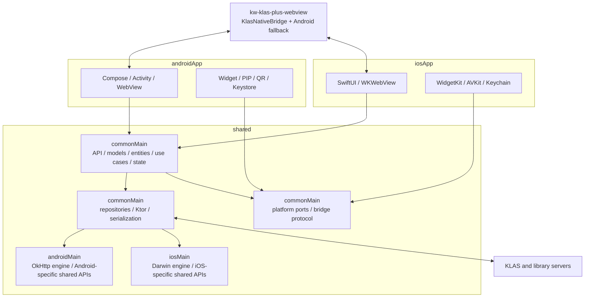

# KLAS+ KMP 전환 아키텍처 및 실행 계획

## 1. 개요

이 프로젝트는 전체 재작성보다 **strangler 방식의 점진 이전**이 적합하다. 먼저 기존 Android 앱을 현재 저장소에서 그대로 빌드 가능한 기준선으로 복원하고, 인증·세션·브리지 계약을 테스트로 고정한다. 그 다음 `shared` 공통 코어를 추출하고, Android 화면을 한 경로씩 Compose로 교체한다. Android에서 검증된 공통 코어는 iOS SwiftUI에서 재사용하되 UI 코드는 공유하지 않는다.

권장 목표는 다음과 같다.

- 공통화: API 네트워크 통신, DTO/엔티티, 인증 상태 머신, 세션 정책, 유스케이스, 플랫폼 중립 상태/ViewModel, 저장소 계약, 브리지 명령/이벤트 모델
- 플랫폼 유지: Android Compose, iOS SwiftUI, 실제 WebView/WKWebView, 쿠키 저장소, 보안 저장소, 생체인식, 앱 잠금 수명주기, QR 스캔, 다운로드/파일 선택, 위젯, PIP
- 호환 전략: Web은 플랫폼 중립 `KlasNativeBridge.*`를 호출하고 Bridge v1 transport를 우선 사용한다. 구 Android 앱 호환은 Web adapter의 `window.Android` fallback이 담당한다.
- 릴리스 전략: Android를 각 단계마다 배포 가능한 상태로 유지하고, iOS는 공통 코어가 안정화된 뒤 기능 슬라이스 단위로 추가

## 2. 분석 범위와 근거

### 2.1 현재 로컬 보일러플레이트

| 모듈 | 현재 상태 | 필요한 변화 |
|---|---|---|
| `androidApp` | 기존 View 앱과 Android 플랫폼 어댑터 | View→Compose 점진 전환, Android WebView·시스템 기능 소유 |
| `shared` | Android+iOS KMP 타깃 | 공통 네트워크·모델·엔티티·유스케이스·상태·플랫폼 API 구현 |
| `iosApp` | SwiftUI 진입점 | `Shared.framework` 연결, SwiftUI·WKWebView·iOS 시스템 기능 소유 |

### 2.2 기존 Android 앱

원본: <https://github.com/IceCream0910/kw-klas-plus>

Manifest와 소스에서 확인한 주요 구성은 다음과 같다.

- 13개 Activity: 시작/자동 로그인, 수동 로그인, 홈, 강의 홈, 강의계획서, 게시판, 과제, 링크, 비디오, QR 출석, 설정, 앱 잠금, 도서관 위젯 표시
- 1개 AppWidgetProvider: 도서관 이용증
- 대부분의 제품 UI: `klasplus.yuntae.in`의 WebView 페이지
- 학교 KLAS UI/데이터 접근: `klas.kw.ac.kr` WebView 및 네이티브 HTTP
- Native ↔ Web: AndroidX WebKit의 `KlasNativeBridgeNative.postMessage` Bridge v1과 JSON-safe callback dispatcher
- 네이티브 기능: 생체인식 앱 잠금, Android PIP, QR 스캔, 다운로드/파일 선택, 홈 화면 위젯, 인앱 업데이트, 외부 앱/브라우저 실행, 햅틱

특히 `HomeActivity` 약 1,673행, `VideoPlayerActivity` 약 920행, `LectureActivity` 약 661행으로 UI, 브리지, 네트워크, 내비게이션, 플랫폼 기능이 한 클래스에 혼재한다. 이 코드를 공통 모듈로 그대로 이동하면 플랫폼 결합만 옮겨갈 뿐이므로 먼저 계약과 상태를 분리해야 한다.

### 2.3 WebView 웹 앱

원본: <https://github.com/IceCream0910/kw-klas-plus-webview>

Next.js 웹 앱이 홈 피드, 시간표, 강의, 캘린더, 성적, 프로필, 설정, 장학, KLAS AI 등의 실질 UI를 제공한다. Web 페이지는 `KlasNativeBridge.*`만 호출하며 adapter가 Bridge v1 request/response와 15초 timeout을 관리한다. Native transport가 없거나 `UNKNOWN_METHOD`를 반환하면 구 Android 앱의 `window.Android`를 사용한다.

M6-004와 M6-005에서 Web adapter와 계약 smoke를 완료했다. 신 Android 앱은 `KlasNativeBridgeNative.postMessage`만 노출하며 `window.Android` façade를 제공하지 않는다. Android 배포 지원 조합은 신 Web + 구 Android, 신 Web + 신 Android이며 구 Web + 신 Android는 지원하지 않는다. 신 Web + iOS는 M6-007 완료 후 같은 Bridge v1 계약으로 지원한다.

## 3. 목표 아키텍처



### 3.1 모듈 구조

권장 디렉터리 구조는 단일 KMP 코어와 플랫폼별 UI의 역할을 명확히 하는 형태다.

```text
androidApp/
  src/main/
    kotlin/.../app/                 # Application, MainActivity
    kotlin/.../ui/theme/            # Android Compose Material theme
    kotlin/.../ui/layout/           # window size and responsive layout policy
    kotlin/.../feature/             # Compose screen by product feature
    kotlin/.../platform/biometric/  # FragmentActivity/BiometricPrompt
    kotlin/.../platform/file/       # Activity Result/WebChromeClient
    kotlin/.../platform/pip/        # Activity/PIP UI
    kotlin/.../platform/qr/         # Activity/Google scanner UI
    kotlin/.../platform/navigation/ # 앱 Activity route
    kotlin/.../platform/web/        # WebView holder/auth/bridge adapter
    kotlin/.../platform/bridge/     # legacy 앱 bridge handler
    kotlin/.../widget/              # AppWidgetProvider, RemoteViews/Glance 선택
    kotlin/.../video/               # PIP 전용 Activity/controller
    kotlin/.../migration/           # 구 SharedPreferences 데이터 이전

shared/
  src/commonMain/kotlin/.../
    core/network/                    # Ktor client, API transport, error mapping
    core/model/                      # DTO, entity, value object
    core/auth/                       # AuthStateMachine, LoginUseCase
    core/session/                    # Session policy and repository
    core/bridge/                     # versioned command/event schema
    core/platform/                   # ports/interfaces only
    core/presentation/               # platform-neutral state/ViewModel
  src/androidMain/kotlin/.../
    core/AndroidSharedDependencies  # Android 공통 코어 composition
    core/network/                   # OkHttp engine
    core/auth/                      # SharedPreferences credential adapter
    core/session/                   # session/timestamp/CookieManager adapter
    core/security/                  # Keystore SecureStore
    core/migration/                 # legacy secret source/mapping
    core/library/                   # AES codec, cache, Android service
    core/platform/                  # external navigation, haptics
    core/lock/                      # app lock secret adapter
  src/iosMain/kotlin/.../            # Darwin engine, iOS-specific shared APIs

iosApp/
  iosApp/                            # SwiftUI entry, WKWebView and native integrations
  widgetExtension/                   # WidgetKit + App Group
```

### 3.2 iOS framework 구성

`shared`에 `iosArm64`와 `iosSimulatorArm64` 타깃을 두고 정적 `Shared.framework` 하나만 iOS 앱에 노출한다. SwiftUI는 공통 상태와 유스케이스를 직접 소비하며 Compose UIViewController를 호스팅하지 않는다. WKWebView와 iOS 시스템 기능은 `iosApp`이 소유하고, 필요한 구현을 `shared`의 port에 주입한다. 이번 Android 구조 정리 단계에서는 iOS 기능을 구현하지 않고 framework 빌드 연결과 소스셋 경계만 유지한다.

`AndroidSharedDependencies`는 Android의 network engine, storage adapter와 공통 repository/use case를 조립한다. iOS 확장 시 동일한 공통 계약에 Darwin engine, Keychain/UserDefaults/cache adapter를 주입하는 `IosSharedDependencies`를 `iosMain`에 둔다. 플랫폼 앱은 이 container가 제공하는 공통 기능과 상태를 소비하고, UI 수명주기가 필요한 adapter만 자체 composition root에서 생성한다.

## 4. 핵심 계약

### 4.1 인증 상태 머신

현재 동작을 다음 상태로 명시한다.

```text
ColdStart
  ├─ no credential ─> NeedsCredentials
  ├─ server-valid stored session ─> Authenticated
  └─ stored credential ─> PlatformLogin

NeedsCredentials
  └─ POST plaintext password over TLS to SelectScrtyPwd.do
       ├─ success: save server-encrypted password ─> PlatformLogin
       └─ failure ─> RecoverableError

PlatformLogin
  ├─ common: LoginSecurity → RSA loginToken → LoginCaptcha → LoginConfirm HTTP
  ├─ Android: OkHttp cookie jar + JVM RSA/PKCS#1 v1.5
  ├─ iOS: Darwin cookie jar + Security.framework RSA/PKCS#1 v1.5
  ├─ SESSION observed ─> persist session ─> Authenticated
  ├─ CAPTCHA/temp password/additional authentication ─> UserActionRequired
  └─ timeout/network/server failure ─> RecoverableError

Authenticated
  ├─ WebView: cookie store contains SESSION
  ├─ Native HTTP: Cookie: SESSION=<token>
  ├─ startup/foreground lease check: /session/info
  │    ├─ active ─> schedule next foreground check
  │    ├─ near expiry ─> UpdateSession.do ─> /session/info confirmation
  │    └─ server expiry ─> clear session/cookie ─> PlatformLogin
  └─ timeout/network/server failure ─> preserve session and bounded retry
```

구현 원칙:

- 상태 전이는 `shared`에서 순수하게 테스트한다.
- `commonMain`의 `KlasHttpAuthDriver`가 양 플랫폼 HTTP 로그인 순서, JSON 계약, 쿠키 SESSION 추출과 오류 매핑을 소유한다. Android는 OkHttp/JVM RSA, iOS는 Darwin/Security.framework RSA 어댑터만 제공한다.
- 기존 `IosWebAuthDriver`는 rollback과 CAPTCHA/DOM 특성 테스트 자산으로 유지하되 제품 기본 인증 경로에서는 사용하지 않는다.
- `CredentialStore`, `SessionStore`, `WebCookieStore`, `Clock`, `KlasAuthApi`를 주입한다.
- 평문 입력의 암호화와 credential 검증 저장은 `PrepareCredentialUseCase`, 저장 credential을 이용한 Web 로그인과 SESSION 반영은 `LoginUseCase`가 소유한다.
- HTTP 인증이 지원하지 못하는 후속 보안 흐름은 사용자 조치 결과로 분리하고 KLAS 브라우저 로그인을 안내한다. 평문·암호화 비밀번호와 loginToken은 로그에 남기지 않는다.
- 로컬 고정 TTL은 사용하지 않는다. `SessionLeaseManager`가 `/api/v1/session/info`의 `remainingTime`을 서버 기준으로 판정하고, 연장 응답 뒤 `/info`를 다시 조회해 시간이 증가한 경우만 성공으로 인정한다.
- `SessionLeaseManager.maintain()`은 lifecycle을 모르는 공통 one-shot 계약이다. Android `ProcessLifecycleOwner`와 iOS SwiftUI `scenePhase`는 앱 foreground에서 반복 호출하고 background에서 중단하며, 향후 WorkManager·BGTask·snapshot 동기화도 같은 계약을 재사용한다.
- 명시적 만료(401/403, 로그인 HTML, `remainingTime == 0`)만 세션을 폐기한다. timeout·network·5xx·malformed 응답은 세션을 보존하고 제한 주기로 재시도한다.
- 앱 시작 시 WebView 쿠키와 네이티브 세션 저장소를 한 방향으로만 우연히 복사하지 않는다. 명시적인 `SessionCoordinator`가 갱신·삭제·타임스탬프를 함께 처리한다.
- 로그아웃/계정 변경 시 일반 세션, WebView cookie, localStorage의 토큰, 보안 자격증명을 정책에 따라 원자적으로 삭제한다.

### 4.2 플랫폼 저장소 분류

| 데이터 | 분류 | Android | iOS |
|---|---|---|---|
| 학번, 테마, 학기, UI 설정 | 일반 설정 | SharedPreferences/DataStore adapter | UserDefaults adapter |
| 서버 암호화 KLAS 비밀번호 | 비밀 | Keystore 보호 SecureStore | Keychain |
| `SESSION` 및 타임스탬프 | 비밀/세션 메타데이터 | 토큰 SecureStore + 일반 timestamp + CookieManager | 토큰 Keychain + 일반 timestamp + WKHTTPCookieStore |
| 도서관 비밀번호, secret, authKey | 비밀 | Keystore 보호 SecureStore | Keychain |
| 앱 잠금 hash/salt/flags | 비밀 설정 | Keystore 보호 SecureStore | Keychain |
| Widget 표시용 최소 데이터 | 공유 캐시 | 위젯 접근 가능한 앱 내부 저장소 | App Group UserDefaults/파일, 비밀 원문 금지 |

기존 Android의 `EncryptedSharedPreferences`는 AndroidX에서 deprecated 상태다. 신규 구현은 Keystore로 키를 보호하는 자체 `SecureStore` 또는 검증된 대안을 사용하되, 기존 파일을 먼저 읽어 신규 저장소에 기록하고 검증한 뒤 구 키를 삭제한다. 앱 백업/복원에서 키가 없는 암호문이 복원되지 않도록 backup rule을 함께 검증한다.

Android View 전환 기간에는 `SessionCoordinator`가 Keystore 저장소를 primary로 사용하면서 기존 Activity의 직접 reader를 위해 `kwSESSION`을 한시적으로 미러링한다. credential과 앱 잠금 hash/salt는 신규 reader 연결이 끝난 값부터 read-through 검증 후 구 키를 삭제한다. 미러 제거는 모든 직접 reader가 공통 session port로 전환되고 업그레이드 실기기 검증이 끝난 뒤 수행한다.

Android Auto Backup과 device transfer에서는 Keystore 암호문, legacy secure prefs, SESSION 미러가 포함된 메인 prefs, 도서관 QR 캐시를 제외한다. 따라서 기기 복원 후에는 재로그인이 필요하며, 일반 설정의 선택적 백업은 SESSION 미러 제거 후 별도 설정 파일로 분리해 다시 허용한다.

### 4.3 네트워크

`shared`의 공통 네트워크 계층은 Ktor Client + kotlinx.serialization을 사용한다.

- Android engine: OkHttp
- iOS engine: Darwin/NSURLSession
- 공통 처리: content type, timeout 정책, DTO, 오류 매핑, 세션 헤더, 민감정보 redaction
- 플랫폼 처리: engine/TLS 설정, User-Agent, 네트워크 진단

KLAS 인증/학기/시간표/마감일/출석, 도서관, 학생증 QR와 강의 metadata 요청은 공통 repository/gateway가 소유한다. Android 앱에는 HTTP client와 응답 parser를 노출하지 않으며 `shared/androidMain` 컨테이너가 OkHttp engine과 timeout 구성을 캡슐화한다. WebView에서만 가능한 URL/cookie 발견과 페이지 실행은 HTTP repository처럼 위장하지 않고 공통 `WebScript` factory와 플랫폼 `WebSurface`로 구분한다. 완료된 경계와 재유입 감사 명령은 `docs/ANDROID_COMMONIZATION_AUDIT.md`를 따른다.

### 4.4 WebView와 쿠키

공통 `WebSurfaceController`가 다음 의미를 정의한다.

- load/reload/back/forward
- evaluate JSON-safe script
- 현재 URL과 로딩 상태
- 파일 선택, 다운로드, 새 창, 외부 URL 요청 이벤트
- 브리지 command 수신과 callback 전달
- cookie set/get/clear 및 session observation

플랫폼 구현:

- Android: `android.webkit.WebView`, `CookieManager`, `WebViewClient`, `WebChromeClient`
- iOS: `WKWebView`, `WKWebsiteDataStore.httpCookieStore`, `WKNavigationDelegate`, `WKUIDelegate`, `WKScriptMessageHandlerWithReply`

WebView 인스턴스를 화면 재구성 때마다 만들지 않는다. 화면 수명주기와 분리된 holder/controller로 유지하고, 명시적인 dispose에서 브리지 handler와 delegate를 해제해 누수와 중복 콜백을 막는다.

iOS의 WebView container는 UIKit 자동 content inset을 끄고 `container` safe area의 bottom만 선택적으로 무시한다. keyboard safe area는 무시하지 않아 WKWebView frame이 IME에 맞춰 줄어들게 하며, `visualViewport` resize/scroll 이벤트는 fixed navigation과 modal이 viewport 변화를 관찰할 수 있도록 document-end policy script로 전달한다. Native toolbar·sheet·toast·download overlay는 Web content와 별도로 SwiftUI safe area 안에 배치한다. 회전과 trait 변경은 holder identity를 바꾸지 않으며, native overlay가 표시되는 동안 뒤의 WebView는 hit-test와 VoiceOver 접근성 트리에서 제외한다.

### 4.5 버전형 JavaScript 브리지

Web이 다음 envelope를 갖는 Bridge v1 프로토콜을 우선 사용한다.

```json
{
  "version": 1,
  "id": "request-id",
  "method": "openPage",
  "args": { "url": "https://..." }
}
```

응답/이벤트도 JSON envelope로 통일한다.

```json
{
  "version": 1,
  "id": "request-id",
  "ok": true,
  "result": {}
}
```

원칙:

- 메서드 문자열은 sealed command로 파싱하고 알 수 없는 명령을 거부한다.
- origin, main-frame 여부, URL scheme, 인자 타입/길이를 검증한다.
- Native → JS는 `evaluateJavascript("...${value}...")` 문자열 결합 대신 직렬화한 envelope 하나만 전달한다.
- 웹에는 `KlasNativeBridge.call(method, args): Promise`를 제공한다.
- Web의 구버전 Android fallback은 Promise 호출을 기존 `Android.*`와 callback 함수로 변환한다.
- iOS는 동일한 `KlasNativeBridgeNative` transport를 `WKScriptMessageHandlerWithReply`와 document-start WebKit shim으로 제공한다.
- `getAppLockSettings()`는 Web adapter에서 Promise로 호출하고 Native 응답 result를 사용한다.
- 브리지 스키마와 웹 사용처는 CI에서 대조한다.

## 5. 플랫폼 기능 소유권

| 기능 | 공통에 둘 것 | Android 구현 | iOS 구현 |
|---|---|---|---|
| 앱 잠금 | 정책, 상태, UI 상태 | lifecycle + BiometricPrompt | scene phase + LocalAuthentication |
| 비밀번호 잠금 | 검증 유스케이스 | Keystore-backed hash/salt | Keychain-backed hash/salt |
| QR 출석 | payload/결과/HTTP | Google code scanner | AVFoundation/VisionKit 후보 spike |
| 도서관 QR | API/파싱/캐시 정책 | 위젯 갱신, QR bitmap | WidgetKit timeline, SwiftUI QR |
| 강의 PIP | 플레이어 명령/상태 | PictureInPictureParams | WK `allowsPictureInPictureMediaPlayback` (ADR-005) |
| 다운로드 | 요청 모델/정책 | DownloadManager/SAF | URLSession/share sheet/files |
| 파일 선택 | 요청/결과 모델 | Activity Result API | UIDocumentPicker/Photos picker |
| 외부 링크 | URL 정책 | Intent | UIApplication/openURL |
| 햅틱 | 의미 enum | HapticFeedback | UIImpact/Notification feedback |
| 인앱 업데이트 | capability | Play Core | 해당 없음; App Store 정책/버전 안내 |
| 테마/방향/태블릿 | 공통 preference | Android window/orientation | iOS trait/orientation 정책 |

플랫폼에 기능이 없을 때 조용히 무시하지 않는다. `Supported`, `Unavailable(reason)`, `PermissionRequired` 같은 capability 결과를 공통 UI에 전달한다.

## 6. Android 마이그레이션 전략

### 6.1 기준선 복원

현재 샘플 `androidApp`을 곧바로 새 구현으로 채우기 전에 원본 Android 소스를 동일 저장소에서 빌드 가능하게 만든다. 두 선택지 중 첫 번째를 권장한다.

1. `androidApp`에 원본 앱을 가져오고 Compose를 병행 활성화
2. 임시 `legacyAndroidApp` 모듈을 추가하고 새 `androidApp`과 나란히 비교

동일 applicationId를 동시에 설치할 수 없으므로 비교용 flavor/applicationId suffix를 사용한다. 배포 서명과 versionCode는 운영 flavor만 기존 값을 잇는다.

### 6.2 전환 순서

Android는 위험이 낮고 경계가 뚜렷한 순서로 바꾼다.

1. 상수/DTO/오류 타입/세션 정책 추출
2. KLAS 출석 및 도서관 API repository 추출
3. 시작/로그인 상태 머신 추출, 기존 View UI에 연결
4. 공통 브리지 router 도입, 화면별 command delegate 연결
5. Compose 앱 셸과 내비게이션 도입
6. 로그인/로딩/오류/설정 네이티브 오버레이를 Compose로 교체
7. Home/Lecture/Board/Task/Link WebView host를 공통 패턴으로 통합
8. QR, 다운로드, 잠금, 위젯, PIP를 새 port에 연결
9. 사용되지 않는 Activity/View/XML을 기능별로 삭제

WebView 콘텐츠를 Compose 네이티브 화면으로 재작성하는 것은 이번 범위가 아니다. Compose는 WebView 컨테이너와 네이티브 표면을 담당한다.

### 6.3 Compose 반응형 레이아웃 기준

Android 네이티브 화면은 가로 dp를 기준으로 compact(<600dp), medium(600~839dp), expanded(>=840dp)로 분류한다. compact와 medium 세로 화면은 읽기 순서를 유지하는 단일 열을 기본으로 하고, expanded 또는 높이가 짧은 medium 가로 화면은 정보와 조작 영역을 두 열로 배치한다. 콘텐츠 최대 너비, safe drawing inset, 세로 스크롤, 최소 터치 영역을 공통 규칙으로 적용하며 Activity에서 기기 모델이나 고정 픽셀을 직접 판별하지 않는다.

단일 WebView만 표시하는 Activity도 Compose `AndroidView` 기반 호스트로 전환한다. 다만 웹 콘텐츠는 기존 Web 반응형 정책을 따르므로 네이티브 compact/medium/expanded 재배치 대상에서는 제외한다. 해당 Activity는 기존 `WebSurface` 수명주기와 브리지 계약을 유지하고 제목·로딩·오류·시스템 inset 같은 네이티브 표면만 Compose가 소유한다. View/XML 자산은 각 화면의 폰·태블릿·회전·접근성 실기기 패리티가 끝난 뒤 기능 단위로 삭제한다.

## 7. iOS 확장 전략

iOS는 Android 전환 완료를 기다려 한 번에 만들지 않고, 공통 계약이 안정된 슬라이스부터 병행한다.

1. `Shared.framework`와 빈 SwiftUI 앱의 공통 API 연결
2. WKWebView + origin 제한 + `KlasNativeBridgeNative` Bridge v1 handler
3. 수동 로그인 → 웹 로그인 → SESSION 추출 → 앱 재시작 세션 복구
4. 홈/시간표/프로필 등 읽기 중심 WebView 경로
5. 외부 링크, modal, 파일 다운로드/선택
6. 설정, 앱 잠금, 생체인식, Keychain
7. QR 출석
8. 비디오/PIP
9. WidgetKit 도서관 이용증

iOS WidgetKit과 PIP는 앱 본체와 별도의 extension/entitlement/실기기 검증이 필요하므로 마지막에 몰아넣지 말고 초기에 기술 spike를 수행한다. 다만 spike 코드는 운영 경로에 바로 합치지 않는다.

## 8. 테스트 전략과 릴리스 게이트

### 8.1 테스트 층

- 계약 테스트
  - 모든 브리지 메서드/인자/콜백 스냅샷
  - AppPrefs 구키 → 신규 모델 매핑
  - URL/origin allowlist
  - 온라인 강의 player는 HTTPS `kw.ac.kr` host boundary만 허용하고 suffix 위장·userinfo·port를 거부
- 공통 단위 테스트
  - 인증 상태 전이, session TTL, 오류 매핑, repository
  - 고정 Clock/Fake SecureStore/Ktor MockEngine 사용
- 플랫폼 통합 테스트
  - Android WebView CookieManager ↔ SecureStore
  - iOS WKHTTPCookieStore ↔ Keychain
  - JS shim 요청/응답, navigation, back 처리
- UI 테스트
  - Compose 로그인/오류/잠금/권한 상태
  - Android 기존 스크린샷 및 동작 비교
- 실기기 테스트
  - 생체인식, QR 카메라, PIP, 위젯, 파일 다운로드, 프로세스 종료/복원
- Web 저장소 테스트
  - 브리지 미존재 브라우저 fallback
  - Bridge v1 Promise adapter와 구 Android fallback

### 8.2 Android 패리티 게이트

각 기능은 다음을 모두 만족해야 신규 경로를 기본값으로 켠다.

- 기능 패리티 매트릭스의 Android 기준 시나리오 통과
- 기존 사용자 데이터로 업그레이드 성공
- 세션/자격증명/쿠키 손실 없음
- crash-free/로그인 성공률/페이지 로드 오류율 관측 가능
- 원격 또는 로컬 feature flag로 구 경로 복귀 가능

### 8.3 iOS 베타 게이트

- 지원 OS 최소 버전 확정 — iOS/iPadOS 16.0, iPhone·iPad (`ADR-007`, `Config.xcconfig`)
- 로그인과 세션 복구 반복 테스트
- 모든 브리지 호출의 미지원 기능 처리
- ATS, 도메인, 개인정보 manifest/권한 문구 검토
- Keychain 접근성 등급과 백업/기기 이전 정책 확정
- Widget/PIP/background 동작 실기기 검증

## 9. 보안 및 안정성 개선 항목

패리티를 깨지 않는 범위에서 다음을 마이그레이션 게이트로 다룬다.

| 관찰 | 위험 | 조치 |
|---|---|---|
| credential을 JS 문자열에 직접 삽입 | 따옴표/escape 문제, script injection | JSON 직렬화 envelope 사용 |
| Android 자동 로그인이 KLAS DOM/JS와 숨은 WebView에 의존 | 페이지 변경 시 로그인 중단, 불필요한 WebView 수명주기 | 공통 HTTP 인증 순서와 schema 테스트, 플랫폼 RSA/engine만 분리 |
| loginToken/SESSION이 로그·예외에 노출 | 자격증명·세션 탈취 | secret 값을 결과/로그 문자열에 포함하지 않고 SESSION은 SessionCoordinator로 즉시 전달 |
| JavaScript bridge가 WebView에 광범위 노출 | 외부 페이지가 native 기능 호출 가능 | `KlasNativeBridgeNative`를 exact trusted origin과 main frame에만 연결 |
| 온라인 강의 player가 `klas.kw.ac.kr` 외 KLAS subdomain 사용 | exact 앱 origin만 적용하면 state 주입 중단, 문자열 포함 검사는 host 위장 허용 | 앱 bridge origin과 player content host 정책을 분리하고 HTTPS `kw.ac.kr` DNS boundary 검증 |
| `usesCleartextTraffic=true` | 불필요한 평문 트래픽 허용 | endpoint 조사 후 false 및 예외 최소화 |
| 여러 Activity가 CookieManager 직접 조작 | 세션 불일치/삭제 누락 | SessionCoordinator 단일 소유 |
| 세션을 일반 preferences에 저장 | 토큰 노출 위험 | SecureStore로 이전 |
| deprecated EncryptedSharedPreferences | 장기 유지/백업 문제 | Keystore 기반 신규 store + 데이터 이전 |
| 앱 잠금 SHA-256 단일 반복 | 오프라인 추측 비용 낮음 | 호환 이전 계획 후 검증된 KDF 검토 |
| `allowBackup=true`와 비밀 파일 | 복원 후 키 불일치/비밀 정책 불명확 | backup rules에서 비밀 제외 및 복원 테스트 |
| 일부 WebView Activity `exported=true` | 검증되지 않은 Intent/URL 주입 | exported 필요성 제거 또는 strict validation |
| 민감 WebView 화면의 Sentry screenshot | 자격증명/개인정보 캡처 | 화면/필드 masking 및 첨부 정책 검토 |

평문 비밀번호를 서버 암호화 endpoint로 보내는 프로토콜 자체 변경은 서버 협의 없는 앱 마이그레이션 범위 밖이다. TLS 검증, 메모리/로그 최소화, 실패 시 폐기부터 적용하고 별도 보안 ADR로 다룬다.

## 10. 주요 위험과 대응

| 위험 | 가능성/영향 | 대응 |
|---|---|---|
| 학교 로그인 endpoint/schema/RSA 변경 | 높음/치명 | 공통 HTTP 요청·응답 contract test, malformed 분리, 원격 차단/안내 |
| iOS 학교 로그인 DOM/JS 변경 | 높음/치명 | selector 및 성공 조건 contract test, 원격 차단/안내 |
| 웹 앱과 네이티브 앱의 독립 배포 | 높음/높음 | bridge version negotiation, 구/신 API 동시 지원 |
| Android Compose 전환 중 WebView 상태 손실 | 중간/높음 | stable holder, route별 상태 저장, process recreation test |
| Android/iOS CookieStore 차이 | 높음/높음 | SessionCoordinator, 양 플랫폼 통합 테스트 |
| iOS PIP가 현재 웹 플레이어와 호환되지 않음 | 중간/높음 | ADR-005. 실패 시 인앱 재생 유지 |
| Widget에서 비밀 데이터 접근 | 중간/높음 | 최소 파생 데이터만 App Group 공유, 만료/잠금 정책 |
| 라이브러리 API의 Android 식별값 `device_gb=A` | 높음/중간 | 서버 허용값 조사, iOS 요청 계약 테스트 |

도서관 QR의 Ktor form gateway, 공통 workflow, XML 파싱, 캐시 identity와 만료 정책은 `shared`가 소유한다. Android는 AES/CBC/zero-IV codec과 SharedPreferences cache adapter만 제공한다. `device_gb=A` 유지 및 iOS 확인 조건, secret 30일/authKey 12시간 정책은 ADR-004를 따른다.

외부 이동은 공통 `ExternalNavigationPolicy`가 `http`, `https`, `mailto`, `tel`만 허용한다. Android `Intent` 생성은 정책이 반환한 typed destination에 대해서만 수행하며 `javascript`, `intent`, `file` 및 제어문자 포함 값은 거부한다. legacy 햅틱 14개 이름은 공통 enum으로 보존하고 플랫폼에는 selection/confirm/reject/long-press 의미로 전달한다.

`WebSurface`는 URL 로드와 WebView 객체를 노출하지 않고 loading/ready/error, back/forward, reload/stop, JSON-safe script 평가, dispose 상태를 제공한다. Android holder는 기존 Activity의 WebViewClient callback을 입력받는 방식으로 공존하며, Compose 전환 전까지 기존 client를 교체하지 않는다. 생체인식과 PIP는 각각 typed platform result와 `PictureInPictureState`를 통해 Android adapter에 연결하고 플랫폼 UI callback/RemoteAction은 Android app이 소유한다.

Android holder/client 구현은 `androidApp`이 소유하고 기존 View Activity는 page callback과 dispose만 전달한다. iOS WKWebView holder/client는 `iosApp`의 `WebViewHolder`가 소유한다. Holder는 persistent `WKWebsiteDataStore.default()`와 navigation snapshot(`idle|loading|ready|failed|disposed`, back/forward)을 제공하고, main-frame 이동은 공통 `TrustedOriginPolicy`/`ExternalNavigationPolicy`로 allow·external·cancel을 분기한다. SESSION cookie는 WebSurface가 복제하지 않고 `SessionCoordinator`와 `WebCookieStore`가 단일 소유한다. iOS 구현은 `shared/iosMain`의 `IosWebCookieStore`가 동일 default data store의 `WKHTTPCookieStore`에 Android와 같은 `SESSION`/`Domain=.kw.ac.kr`/`Path=/`/`Secure; HttpOnly` 계약을 기록한다. Android는 `window.Android`를 등록하지 않고 AndroidX WebKit message listener `KlasNativeBridgeNative`와 document-start `KlasNativeBridge` adapter를 허용 origin에만 주입한다. iOS는 `IosBridgeMessageAdapter`가 `WKScriptMessageHandlerWithReply`와 document-start WebKit transport shim·`KlasNativeBridge` adapter를 같은 계약으로 연결한다. 일반 surface는 두 앱 origin을 exact match하고, Video surface는 HTTPS `*.kw.ac.kr` player origin을 추가로 허용한다. listener/handler가 전달한 source origin과 main-frame 여부는 공통 Bridge v1 validator가 다시 검증한다.

Android 앱은 코드/콘텐츠 endpoint가 모두 HTTPS임을 확인한 상태에서 cleartext traffic을 기본 차단한다. 외부 진입 계약이 없는 Activity는 exported하지 않으며, 오류 수집에는 screenshot과 view hierarchy를 첨부하지 않는다.
| 현재 로컬 폴더에 Git 이력 없음 | 높음/높음 | 구현 전 저장소 초기화/remote/기준 커밋 고정 |
| SDK/AGP/Kotlin 버전 불일치 | 높음/중간 | 호환 매트릭스 및 CI로 한 조합 고정 |

## 11. 의사결정 기록이 필요한 항목

구현 전에 다음 ADR을 작성한다.

1. `ADR-001`: 단일 `shared` 코어 + Android Compose/iOS SwiftUI
2. `ADR-002`: 브리지 v1 envelope와 웹/앱 버전 협상 — `docs/adr/ADR-002-bridge-v1-protocol.md` 승인
3. `ADR-003`: Android SecureStore 및 구 데이터 이전 방식
4. `ADR-004`: 네트워크 계층(Ktor engine, cookie ownership, User-Agent)
5. `ADR-005`: iOS PIP 방식(WKWebView media vs AVPlayer) — `docs/adr/ADR-005-ios-player-pip.md` 승인(M7-003)
6. `ADR-006`: Widget 공유 데이터와 잠금 상태 정책
7. `ADR-007`: min Android/iOS 버전과 태블릿/회전 정책 — `docs/adr/ADR-007-min-platform-versions.md` 승인(최소 OS·기기). 태블릿/회전 UI 세부는 Android §6.3, iOS M6-011

## 12. 완료 기준

마이그레이션 1차 완료는 다음 상태를 의미한다.

- Android 운영 앱의 모든 `P0/P1` 기능이 Compose/KMP 구조에서 패리티 통과
- 기존 설치에서 자격증명·세션·설정·도서관 정보의 무손실 업그레이드
- Web bridge v1과 legacy adapter가 Android/iOS 모두에서 계약 테스트 통과
- iOS에서 로그인, 홈/강의/과제/게시판, 앱 잠금, QR, 다운로드, PIP, 위젯의 승인된 기능 범위 제공
- 플랫폼별 미지원/차이가 사용자에게 명시되고 문서화됨
- 회귀 지표, 단계적 rollout, 롤백 경로가 준비됨

## 13. 공식 참고 자료

- Kotlin Multiplatform의 플랫폼 API 분리: <https://kotlinlang.org/docs/multiplatform/multiplatform-connect-to-apis.html>
- `expect`/`actual` 규칙: <https://kotlinlang.org/docs/multiplatform/multiplatform-expect-actual.html>
- Kotlin Multiplatform iOS framework 연결: <https://kotlinlang.org/docs/multiplatform/multiplatform-direct-integration.html>
- Android Compose 아키텍처: <https://developer.android.com/develop/ui/compose/architecture>
- Apple SwiftUI: <https://developer.apple.com/documentation/swiftui>
- Ktor Android/iOS client engine: <https://ktor.io/docs/client-engines.html>
- Android Keystore: <https://developer.android.com/privacy-and-security/keystore>
- `EncryptedSharedPreferences` deprecation: <https://developer.android.com/reference/androidx/security/crypto/EncryptedSharedPreferences>
- Apple Keychain: <https://developer.apple.com/documentation/security/keychain-services>
