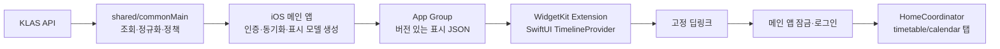

# ADR-005: iOS 학사 시간표·캘린더 WidgetKit 확장 설계

- 상태: Accepted (구현 완료)
- 날짜: 2026-09-12 (구현 완료: 2026-09-15)
- 기준: Android 학사 위젯 [ADR-004](ADR-004-android-academic-widgets.md), iOS/iPadOS 16.0, 기존 도서관 QR 정적 위젯 [ADR-002](ADR-002-ios-library-qr-widget.md)

## 목표와 경계

Android의 시간표·캘린더 위젯과 동일한 학사 데이터 의미, 날짜/주말/색상 정책, 잠금 후 탭 진입을 제공한다. 도서관 QR 위젯은 개인정보가 없는 정적 런처라 App Group을 사용하지 않는 기존 결정이 그대로 유지된다. 학사 위젯은 표시할 데이터가 있으므로 별도의 공유 스냅샷이 필요하다. 메인 앱은 `shared/commonMain`의 `AcademicWidgetSnapshot`, `TimetableEntry`, `CalendarEvent`, `AcademicWidgetPolicy`, `WidgetClassPolicy`, `TimetableColorPolicy`로 표시 모델을 구성한다. 현재 정적 QR extension은 Shared.framework를 링크하지 않으므로 학사 extension은 우선 버전 있는 JSON 표시 모델만 Swift로 디코딩하는 가벼운 구조를 택한다. WidgetKit View, timeline, 앱 수명주기와 저장 어댑터는 iOS가 소유한다. 확장 프로세스가 Android API, WebView, Android 저장소를 참조하지 않는다.

## 데이터 공유와 보안

메인 앱은 현재 계정과 학기를 확인한 후 공통 정책에서 유도한 플랫폼 중립 표시 JSON(schema version, 소유자 식별값, 학기, 월, 원본 시작/종료 시각, light/dark 색상, 마지막 성공 시각)을 App Group container에 원자적으로 기록한다. 확장은 읽기 전용으로 처리하고 schema version, 학기·월 일치, 디코딩 성공 여부를 확인한다. `AcademicWidgetSnapshot`의 현재 `owner`는 학번의 SHA-256이며 비밀 값은 아니지만 계정 연관 식별자이므로 로그/화면에 노출하지 않는다. 확장은 별도로 공유한 활성 owner marker와 스냅샷 owner가 일치할 때만 표시한다. 과목명, 강의실, 일정명은 개인정보다. App Group ID와 양 타깃 entitlement를 명시적으로 고정하고, 파일 보호 등급·잠금 중 읽기 가능성은 실제 기기에서 결정한다. 보호 데이터에 접근할 수 없으면 `데이터를 열 수 없음` placeholder를 표시한다. 표시 DTO의 Kotlin 직렬화와 Swift 디코딩은 fixture 계약 테스트로 묶는다.

SESSION 쿠키, 저장 자격증명, 암호화 비밀번호, 앱 잠금 PIN/Keychain 항목을 App Group 파일이나 확장 프로세스로 복제하지 않는다. 네트워크 조회와 재인증은 기본적으로 메인 앱의 기존 `IosSharedDependencies`/세션 경로가 담당한다. 확장에서 직접 KLAS에 접속해야 하는 요구가 생기면 Keychain access group, 확장 권한, 토큰 만료·재인증·잠금 화면의 위협 분석과 실기기 검증을 별도 ADR로 선행한다. 이 설계에서는 확장 자체가 로그인하거나 인증 비밀을 읽지 않는다. 기존 도서관 QR 확장에 App Group 권한을 불필요하게 추가하지 않고, 학사 위젯만 공유 저장소에 연결한다.

계정 전환·로그아웃 시 메인 앱은 활성 owner marker와 공유 파일을 지우고 `WidgetCenter.reloadTimelines`를 요청한다. 학기 변경 시 시간표를 무효화하고 일정 월 변경 시 월 캐시를 무효화한다. 새 timeline entry는 매번 현재 marker와 스냅샷의 owner/schema를 대조한다. 단, WidgetKit이 이미 렌더한 이전 timeline의 화면은 reload가 처리될 때까지 남을 수 있으며 즉시 삭제를 보장할 수 없다. 학사 정보의 홈 화면 노출과 로그아웃 직후 잔상 가능성은 구현 전 개인정보 정책으로 승인하거나, 위험을 허용할 수 없다면 iOS 학사 위젯을 잠금 후 앱 실행형으로 축소해야 한다. 탭 후 앱 콘텐츠 접근에는 잠금을 적용한다.

## 표시와 시간 정책

QR, 캘린더, 시간표 세 종류의 WidgetKit `StaticConfiguration`을 `KlasWidgetBundle`에 등록한다. 캘린더 위젯은 `systemSmall`/`systemMedium`(오늘/다가오는 일정 아젠다)과 `systemLarge`/`systemExtraLarge`(월간 캘린더+일정 막대)를 한 종류의 위젯에서 제공한다. 시간표도 한 종류의 위젯에서 `systemSmall`/`systemMedium`(오늘 수업 목록)과 `systemLarge`/`systemExtraLarge`(평일 그리드+주말 과목 목록)를 제공한다. 작은 시간표는 최대 2개, 중간 크기는 최대 4개 수업을 표시하고 초과 개수를 알려준다. 홈 화면 위젯은 스크롤 목록을 지원하지 않으므로 전체 목록은 위젯 탭으로 앱에서 본다. 축소형에는 수업 상태만 표시하고 분 단위 남은 시간·진행률은 넣지 않는다. WidgetKit의 갱신 예산 제약 때문에 분 단위 상태 갱신을 보장할 수 없기 때문이다([이슈 #40](https://github.com/IceCream0910/kw-klas-plus/issues/40)). iPad/홈 화면 family는 지원 OS에서 실제 제공 여부를 확인하고 별도 레이아웃으로 대응한다. Android의 dp 250 경계를 iOS family에 그대로 적용하지 않고, 각 family의 `WidgetFamily`/실제 가용 영역과 Dynamic Type에 맞춰 잘림·빈 상태를 설계한다.

시간표는 학기 데이터가 바뀌거나 앱이 foreground에 들어와 조회에 성공했을 때 스냅샷을 다시 기록한다. 수업 상태/요일 전환은 분 단위 reload 대신 미리 계산한 시작·종료·자정 시점 timeline entry로만 표현한다. 분 단위 `reloadTimelines` 호출이나 연속 progress 애니메이션은 WidgetKit 예산 정책상 보장되지 않으므로 배제하며, Android와 같은 실시간 진행률 표시는 플랫폼 승인 차이로 둔다.

캘린더는 메인 앱에서 현재 월 1일~말일을 공통 `CalendarRepository`/`CalendarSyncUseCase` 의미에 맞게 조회한 뒤 App Group에 기록한다. 앱 진입·일정 수정/추가 후 복귀·월 변경·백그라운드 refresh 기회에 동기화를 요청한다. `BGAppRefreshTask` 등록 및 `earliestBeginDate`는 OS에 대한 요청이며 1시간 간격이나 위젯 추가 즉시 네트워크 조회를 보장하지 않는다. 위젯 추가 직후에는 기존 공유 스냅샷을 즉시 표시하고, 데이터가 없으면 `앱을 열어 일정 가져오기` 상태와 딥링크를 제공한다. 최초 추가 시 앱을 열지 않고 반드시 최신 API 결과가 필요하다면 확장의 인증 권한과 background 실행 정책을 다시 결정해야 한다. 조회 실패에는 마지막 성공 데이터를 보존하고 조회 시각·갱신 지연/로그인 필요를 구분한다.

iOS 16의 홈 위젯은 앱 실행 없이 독립적인 즉시 새로고침 버튼을 지원하지 않는다. 버튼 모양의 URL 탭은 앱을 열어 동기화한 뒤 reload를 요청하는 동작으로 명시한다. iOS 17+ 캘린더 `AppIntent` 새로고침은 [ADR-006](ADR-006-ios-widget-interactive-refresh.md)이 인증 경계와 세션 동기화를 정의한다. 시스템 테마의 light/dark 색상 쌍은 공통 8색 배정을 사용하고, 캘린더 막대·주말 중립색·빈 학기·오늘 일정 없음은 공통 표시 정책을 따른다. SwiftUI 네이티브 View를 우선 사용해 Canvas bitmap rasterize와 메모리 비용을 피한다.

## 진입·잠금·실패

학사 위젯 탭 URL은 도서관 QR의 `kwklasplus://library-qr`와 분리한 고정 경로 `kwklasplus://widget/timetable`, `kwklasplus://widget/calendar`로 확정하고 정확한 scheme/host/path만 allowlist한다. Android의 `klasplus://widget/...`와 scheme이 다르므로 공통 `WidgetDestination`에서 명시적인 플랫폼 URI 매핑을 고정했다. 임의 URL, 쿼리, 외부 host를 WebView에 전달하지 않는다. `StartupRootView.onOpenURL`에 학사 목적지 라우팅을 추가하여 로그인/잠금 완료 뒤 `HomeCoordinator`의 timetable/calendar 탭을 연다. 도서관 QR의 단독 잠금 예외를 학사 위젯에 재사용하지 않는다. 인증 취소·세션 만료에는 보호된 화면을 열지 않는다.

스냅샷 누락·손상·미로그인·학기 불일치·현재 월 불일치를 별도의 placeholder로 처리한다. 네트워크 문제는 마지막 정상 데이터와 갱신 시각을 유지하되 전 계정의 데이터는 절대 재표시하지 않는다. 캘린더와 시간표의 WidgetKind를 분리하면 하나의 데이터 실패가 다른 위젯의 표시를 막지 않는다.

## 구현 순서와 검증 게이트

1. 공유 표시 DTO의 schema version/무효화 정책과 iOS App Group entitlement·파일 보호·로그아웃 잔상 정책을 확정하고 Kotlin encode/Swift decode 계약 및 이전 버전·손상 fallback 테스트를 추가한다.
2. 메인 앱의 계정·학기·월 수명주기에 동기화/원자적 기록/삭제를 연결한다. 시간표는 기존 `IosHomeRuntime.fetchTimetable` 결과를 중복 조회 없이 활용할 수 있도록 구조를 정한다.
3. WidgetKit family별 placeholder/snapshot/timeline과 SwiftUI 접근성 설명을 구현한다. 수업 시작·종료·자정과 달력 월 전환 시점을 테스트한다.
4. URL allowlist → 로그인/앱 잠금 → Home 탭 전달을 기존 QR route와 함께 테스트한다. WebView 콜백 이름과 색상 계약을 유지한다.
5. macOS Xcode 빌드·공통 iOS 타깃 테스트와 iOS simulator의 family/테마 시각 검증 뒤, **실기기**에서 최초 추가·앱 미실행 갱신/OS 지연·재부팅·저전력·Dynamic Type·계정 전환·로그아웃·PIN/Face ID 취소·App Group 파일 보호를 확인한다.

WidgetKit 갱신 예산, 최초 조회 및 정확한 분 단위 표시는 Android JobScheduler/RemoteViews와 달리 OS가 통제한다. 이 차이는 구현 후 실기기 결과를 기록하고 패리티 매트릭스에 승인 차이로 명시한다.
