# ADR-005: iOS 온라인 강의 player·PIP 방식

- 상태: Accepted (M7-003 정책 고정. 실계정 재생·PIP·DRM은 M7-004 실기기 검증)
- 날짜: 2026-08-30
- 작업: M7-003

## 결정

기본 재생 host는 Android와 같은 **WKWebView media**다. Brightcove 페이지를 세 개의 `WebViewHolder`로 유지하고, 제어·진도는 기존 공통 스크립트에 맡긴다. `AVPlayer`로 스트림을 꺼내 재생하지 않는다.

| 항목       | 선택                                                                                                                                | M7-004 소유                                            |
| -------- | --------------------------------------------------------------------------------------------------------------------------------- | ---------------------------------------------------- |
| 재생       | Video `WKWebView`가 `receiveVideoURL` 페이지를 로드. `allowsInlineMediaPlayback = true`, `mediaTypesRequiringUserActionForPlayback = []` | `iosApp` Video 화면                                    |
| 제어       | SwiftUI overlay → `PlayerWebScripts` (`bcPlayController`)                                                                         | 공통 스크립트 재사용, 호스트만 iOS                                |
| 진도       | 숨긴 KLAS holder가 `monitorLectureProgress` 유지                                                                                       | KLAS holder를 dispose하지 않음                            |
| PIP      | WebKit HTML5 PIP (`allowsPictureInPictureMediaPlayback`). `AVPictureInPictureController`는 AVPlayerLayer가 있을 때만                    | `UIBackgroundModes=audio`, `AVAudioSession` playback |
| 미지원      | `PlatformActionResult.Unsupported` + PIP 버튼 숨김 또는 toast. 인앱 재생은 유지                                                                | F-018 승인 차이 후보                                       |
| fallback | WK가 재생하지 못하면 KLAS viewer에 남고 안내. 스트림을 꺼내 AVPlayer로 재생하지 않는다                                                                       | 아래 조건이 모두 증명될 때만 재검토                                 |

이 문서는 제품 플레이어를 열지 않는다. Lecture/Task의 `presentUnavailable()` stub는 M7-004까지 유지한다.

## 근거

Android `[VideoPlayerActivity](../../androidApp/src/main/kotlin/com/icecream/kwklasplus/VideoPlayerActivity.kt)`는 ExoPlayer가 아니다. 목록·KLAS viewer·Brightcove 세 WebView와 Compose overlay, Activity PIP다. iOS에서만 AVPlayer로 낮추면 진도 인증·seek limit·cookie가 Android와 어긋난다.

`AVPictureInPictureController`는 `AVPlayerLayer` 또는 동등한 샘플 버퍼 레이어가 필요하다. WKWebView 내부 HTML5 플레이어를 공개 API로 감쌀 수 없다. iOS에서 Android Activity PIP에 대응하는 것은 WebKit의 `allowsPictureInPictureMediaPlayback`(기본값 `true`)이다.

Brightcove 네이티브 iOS SDK는 새 의존성이고 웹 `bcPlayController` 계약을 대체하므로 쓰지 않는다.

## iOS 재생 API와 채택 이유

iOS에서 강의 재생에 쓸 수 있는 공식 경로는 아래와 같다. PIP는 플레이어가 아니라 위에 붙는 기능이다.

| API                                         | 하는 일                                                                             | 이 앱                            |
| ------------------------------------------- | -------------------------------------------------------------------------------- | ------------------------------ |
| `AVPlayer` + `AVPlayerLayer`                | HLS/mp4를 직접 재생. 컨트롤·PIP(`AVPictureInPictureController`)는 직접 연결                   | 쓰지 않음                          |
| `AVPlayerViewController`                    | 같은 `AVPlayer`에 시스템 UI·잠금 화면·인라인→PIP 자동 전환                                        | 쓰지 않음. Android overlay와 UI가 다름 |
| SwiftUI `VideoPlayer`                       | `AVPlayer`를 SwiftUI로 감싼 뷰                                                        | 쓰지 않음. 본질은 `AVPlayer`와 같음      |
| **WKWebView HTML5**                         | 페이지의 `<video>` / JS 플레이어를 WebKit이 재생. PIP는 `allowsPictureInPictureMediaPlayback` | **채택**                         |
| `AVSampleBufferDisplayLayer` / VideoToolbox | 디코딩 프레임을 직접 그림                                                                   | 해당 없음. 라이브·커스텀 코덱용             |
| Brightcove 네이티브 iOS SDK                     | 내부는 다시 `AVPlayer`                                                                | 쓰지 않음. 웹 계약과 불일치               |

WKWebView HTML5를 고른 이유:

1. **Android와 같은 미디어다.** 기준 앱은 WebView에 Brightcove 페이지를 로드하고 `PlayerWebScripts`로 제어한다. iOS만 네이티브 플레이어로 바꾸면 패리티 대상이 달라진다.
2. `receiveVideoURL`**은 파일이 아니다.** `chkOpen`의 `EMBED src`는 Brightcove 플레이어 페이지다. 그 주소를 `AVPlayer`에 넣어도 재생되지 않는다. HLS/mp4를 한 번 더 추출해야 하고, cookie·FairPlay·`_limitTime`을 앱이 다시 구현해야 한다.
3. **SESSION이 이미 WK에 있다.** `WKWebsiteDataStore.default()` + `IosWebCookieStore`가 `Domain=.kw.ac.kr` SESSION을 들고 있다. `AVURLAsset`은 이 저장소를 쓰지 않는다.
4. **진도와 seek limit이 페이지에 있다.** `lrnCerti`와 `.antopbak` 진도는 KLAS viewer WebView가 살아 있어야 하고, ±10s는 `bcPlayController`의 `_seekLimit`을 따른다. `AVPlayer` seek는 이 제한을 우회할 수 있다.
5. **PIP는 WebKit으로 맞춘다.** `AVPictureInPictureController`는 `AVPlayerLayer`가 있을 때만 붙는다. WK 경로의 PIP는 HTML5 `allowsPictureInPictureMediaPlayback`이다. 원격 ±10s가 시스템 play/pause만 나오면 F-018 승인 차이로 둔다.

`AVPlayer` 계열은 PIP·원격 컨트롤이 더 낫지만, 이 앱의 계약(페이지 URL, cookie, 진도, seek limit)을 깨지 않고는 쓸 수 없다. 재생·진도·seek limit이 모두 증명되기 전에는 재검토하지 않는다.

## Android 계약 → iOS 구조

진입: Lecture `openOnlineLecture` / Task `OnlineCntntsStdPage.do` → `[AppRoute.Video](../../shared/src/commonMain/kotlin/com/icecream/kwklasplus/core/navigation/AppRoute.kt)``(subjectId, yearSemester, session)`.

```mermaid
flowchart LR
  entry["Lecture.openOnlineLecture / Task OnlineCntnts"] --> route["AppRoute.Video"]
  route --> list["listHolder klasplus /onlineLecture"]
  list -->|"requestOnlineLecture JSON"| klas["klasHolder OnlineCntnts"]
  klas -->|"receiveVideoURL + receiveVideoData"| video["videoHolder vod.kw.ac.kr Brightcove"]
  video -->|"receivePlayerStates / receiveInitSpeed"| overlay["SwiftUI VideoPlayerUiState"]
  overlay -->|"PlayerWebScripts"| video
  overlay -->|"WK HTML5 PIP"| pip["allowsPictureInPictureMediaPlayback"]
```

공통 계약은 `shared`에 있다. iOS는 호스트만 추가한다.

- URL·진도 추출: `KlasWebAutomationScripts.reportViewerVideoUrl`, `monitorLectureProgress`
- 목록 열기: `PlayerWebScripts.openOnlineContent` + `PlayerBridgeCodec.decodeOnlineContent`
- 재생 명령: `PlayerWebScripts.playback` / `seekTo` / `move` / `changePlaybackRate` / `setControllerVisible`
- origin: `KlasContentOriginPolicy` — HTTPS `*.kw.ac.kr`, port·userinfo·`https://kw.ac.kr` root 거부
- 제목: `MediaMetadataRepository.fetchTitle`

iOS에 아직 없는 것(M7-004): `VideoBridgeHost`, `IosVideoLegacyBridgeCommandHandler`, `HomeDestination.video`, holder media/PIP 플래그, Video 화면의 `KlasContentOriginPolicy` 네비게이션 허용, `UIBackgroundModes=audio`.

현재 `[WebViewHolder.handleDecidePolicy](../../iosApp/iosApp/WebViewHolder.swift)`는 앱 origin만 인앱으로 두고, `KlasContentOriginPolicy`는 Link `allowsInAppWeb`일 때만 쓴다. Video holder가 `vod.kw.ac.kr`을 로드하면 지금 구현은 Safari로 보낸다. M7-004는 Video surface 전용으로 content host를 허용하고, Link처럼 이후 임의 https를 열어 두지 않는다.

| Android 계약                                         | 의미                                                                 | iOS 매핑                                                       |
| -------------------------------------------------- | ------------------------------------------------------------------ | ------------------------------------------------------------ |
| `completePageLoad`                                 | list에 `receivedData(session, subj, yearHakgi)`                     | Video list holder + `IosWebCallbacks`                        |
| `requestOnlineLecture(json)`                       | codec → `goViewCntnts` / `lrnCerti.checkCerti`                     | 동일 스크립트, KLAS holder 유지                                      |
| `openInKLAS`                                       | 플레이어 숨기고 KLAS 목록 표시                                                | 세 holder 전환. Video는 유지(이어보기)                                 |
| `receiveVideoURL`                                  | content origin 검증 후 Video WebView `loadUrl`                        | Video holder `load`. AVPlayer URL로 쓰지 않음                     |
| `receiveVideoData`                                 | `.antopbak` → 이어보기 초                                               | KLAS holder hidden + 10초 interval                            |
| `receivePlayerStates` / `receiveInitSpeed`         | Brightcove `_currTime/_duration/_isPlaying/_isMuted/_isFullScreen` | 동일 `monitorState` 200ms                                      |
| overlay play/pause/seek/±10s/mute/speed/fullscreen | JS 또는 key event                                                    | SwiftUI → `PlayerWebScripts`. key event 에뮬레이션은 쓰지 않음         |
| PIP enter / remote play·pause·±10s                 | Activity PIP + `RemoteAction`                                      | WK HTML5 PIP. 원격 ±10s는 시스템 컨트롤만 있으면 승인 차이                    |
| PIP 복귀                                             | fullscreen 해제, 컨트롤러 숨김, 폰 세로 고정                                    | 동일 스크립트 + SwiftUI chrome 복원 + `receivePlayerStates` 재동기화     |
| back / Home leave                                  | viewer면 PIP, 목록이면 web back                                         | 목록은 web back. viewer back은 PIP 시도. Home leave 자동 PIP는 실기기 확인 |

진도 보고와 `lrnCerti`는 플레이어가 아니라 **KLAS viewer 페이지**가 담당한다. AVPlayer만 남기고 KLAS holder를 버리면 수강 인증이 깨질 수 있다.

## 제약과 fallback

- **origin:** Video bridge는 HTTPS `*.kw.ac.kr`만. `https://kw.ac.kr` root, port, userinfo, 비HTTPS는 거부. 증거: `BridgeValidatorTest`, `IosBridgeMessageAdapterTests.testVideoSurfaceAllowsKwSubdomainAndRejectsRootHost`.
- **cookie:** SESSION은 `SessionCoordinator` → `IosWebCookieStore` → default `WKHTTPCookieStore` 단일 소유. Video holder도 같은 data store를 쓴다. 평문 비밀번호·SESSION을 로그에 남기지 않는다.
- **DRM:** desk에서는 Widevine/FairPlay 여부를 확인하지 못했다. WK가 Brightcove 페이지를 재생하면 추가 키 없음. 재생 불가면 toast 후 KLAS viewer 유지. 스트림 추출은 하지 않는다.
- **seek limit:** `PlayerWebScripts.move`의 `_seekLimit` / `_limitTime`을 AVPlayer에서 재현하지 않는다. WK 경로를 고른 이유다.
- **PIP 미지원:** 버튼 숨김 또는 “이 기기에서는 PIP를 사용할 수 없습니다.” 인앱 재생·진도는 계속한다. Home leave 때 자동 PIP가 안 되면 재생 유지는 실기기에서 확인하고, 정지가 되면 F-018 승인 차이로 적는다.
- **AVPlayer 재검토 조건 (모두 충족 시에만):** WK가 해당 강의를 재생하지 못함, 추출 스트림이 content origin·cookie 정책을 통과, FairPlay 없이 재생 또는 키 경로가 문서화됨, `_limitTime`과 `receiveVideoData`가 유지됨. 지금은 충족하지 않는다.

## PIP 진입과 복귀

진입 (Android `startPIP` / `onUserLeaveHint`에 대응):

1. 플레이어가 보일 때만.
2. 사용자 PIP 칩 또는 back-in-viewer에서 `webkitSetPresentationMode('picture-in-picture')`를 사용자 제스처로 호출. 제스처 없는 프로그래매틱 진입은 하지 않는다.
3. 필요하면 Brightcove fullscreen을 맞춘 뒤(`KEYCODE_F`에 해당하는 `PlayerWebScripts`) 네이티브 컨트롤러를 숨긴다.
4. 실패하면 `restore`를 호출하고 `Unsupported`를 UI에 전달한다.

복귀 (Android `restorePlayerAfterPictureInPicture`):

1. PIP 종료 또는 `scenePhase == .active`이면서 PIP가 아닐 때 한 번만.
2. `PlayerWebScripts.closeFullScreenIfAvailable()`.
3. `setControllerVisible(false)`.
4. iPhone은 세로 고정. iPad는 기존 회전 정책.
5. 위치·재생 여부는 새 snapshot이 아니라 계속 도는 `receivePlayerStates`로 overlay를 갱신한다.
6. 세 holder와 Video bridge를 dispose하지 않는다.

원격 동작: WK PIP가 play/pause만 주면 ±10s는 인앱 overlay 전용으로 두고 F-018 승인 차이로 기록한다. Android `RemoteAction` 3개(−10 / play-pause / +10)를 iOS에서 보장하지 않는다.

## M7-004 범위

구현할 것

- `VideoBridgeHost`와 `IosVideoLegacyBridgeCommandHandler` (9개 Video command).
- `HomeDestination.video`와 Lecture/Task stub 제거.
- 세 `WebViewHolder` + SwiftUI overlay (`VideoPlayerUiState`와 동일 필드).
- Video holder: inline media, user-gesture 없음, PIP 허용. `decidePolicy`에 `KlasContentOriginPolicy` 허용.
- `Info.plist` `UIBackgroundModes=audio`, playback `AVAudioSession`.
- 시뮬레이터: 목록·열기·JS 제어. 실기기: 재생, 이어보기, 진도, PIP, 잠금 화면, 중단 복구.