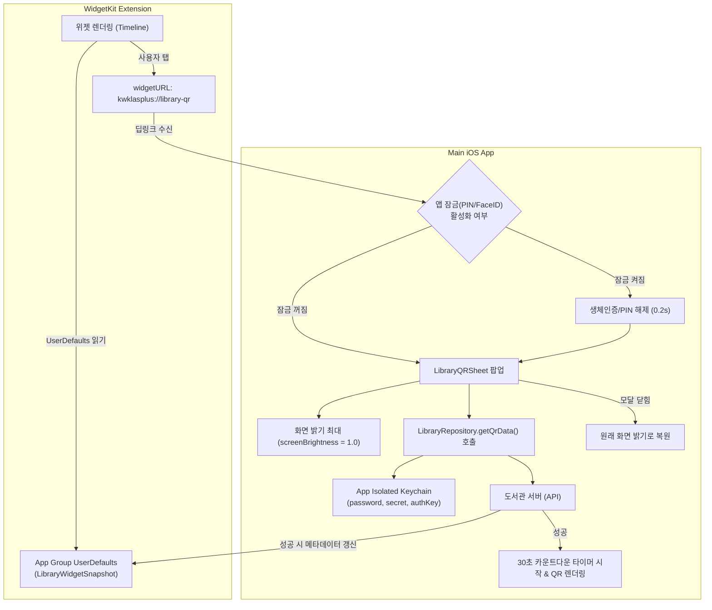

# ADR-006: iOS 도서관 출입증 QR App Group 및 WidgetKit 공유 정책

- 상태: Accepted (M7-005 정책 고정. 구현은 M7-006)
- 날짜: 2026-09-05
- 작업: M7-005

## 결정 요약

iOS 도서관 출입증 위젯은 **WidgetKit Launcher 방식**(`widgetURL` / Deep Link)으로 동작하며, 위젯에는 학생증 메타데이터(이름, 학번, 학과, 소속) 카드 UI를 렌더링하고 위젯 탭 시 딥링크(`kwklasplus://library-qr`)를 통해 앱이 즉시 열려 화면 밝기 최대(`screenBrightness = 1.0`)로 30초 최신 QR 모달을 표시한다.

| 항목 | 결정 내용 | 소유 및 저장소 |
|---|---|---|
| **위젯 UI 및 실행** | Small: 출입증 런처 아이콘<br>Medium: 모바일 학생증 카드(이름, 학번, 학과, 상태)<br>탭 시 `widgetURL("kwklasplus://library-qr")` | `iosApp` Widget Extension (`WidgetKit`) |
| **위젯 공유 캐시** | `LibraryWidgetSnapshot` JSON 메타데이터<br>(학번, 이름, 학과, 소속, 설정 완료 여부, 잠금 여부, 갱신 일시) | App Group `UserDefaults(suiteName: "group.com.icecream.kwklasplus")` |
| **비밀번호 및 토큰** | 도서관 비밀번호 및 세션 토큰(`secret`, `authKey`)은 메인 앱에 격리 | `iosApp` 전용 Keychain (`IosKeychainSecureStore`)<br>(위젯에는 절대 공유하지 않음) |
| **화면 밝기 및 갱신** | 앱 진입 시 `screenBrightness = 1.0` 설정, 30초 카운트다운 타이머 후 자동 새로고침, 닫힐 때 원래 밝기 복원 | `iosApp` SwiftUI 도서관 QR 모달 (`M7-006`) |
| **앱 잠금 상호작용** | 잠금 활성화 시 위젯 카드 정보 마스킹(`홍*동`, `2020****`)<br>위젯 탭 시 Face ID/PIN 해제 즉시 QR 모달 팝업 | `AppLockController` + `HomeCoordinator` |
| **딥링크 스키마** | `kwklasplus://library-qr` (출입증 열기)<br>`kwklasplus://library-qr/settings` (설정 열기) | `iosApp` URL Types 등록 및 라우팅 |

---

## 기술 후보군 비교 및 채택/기각 이유

### 1. 위젯 표시 및 실행 API

| 기술 후보군 | 동작 방식 | 채택 여부 | 채택 / 기각 이유 |
|---|---|---|---|
| **WidgetKit + Deep Link (`widgetURL`)** | 위젯에 학생증 카드 표시, 탭 시 딥링크(`kwklasplus://library-qr`)로 앱 실행 후 즉시 QR 모달 팝업 | **채택** | 1. **Android와 100% 동일 UX**: Android 기준 앱의 `LibraryQRWidget`도 탭 시 투명 액티비티(`LibraryQRWidgetActivity`)로 바텀시트를 띄우는 런처 방식임.<br>2. **화면 밝기 최대 구현**: 도서관 게이트 바코드 인식에는 최대 화면 밝기(`screenBrightness = 1.0`)가 필수적입니다. 위젯 화면 자체에서는 iOS 제약상 밝기를 제어할 수 없지만, Deep Link를 통해 앱 화면을 띄움으로써 앱 내에서 화면 밝기를 100% 최대로 끌어올릴 수 있습니다.<br>3. **30초 만료 안정성**: 도서관 QR은 30초마다 갱신되어야 하나, WidgetKit은 백그라운드 30초 주기로 실시간 갱신할 수 없음(Apple 배터리 타임라인 예산 정책). 앱에서 카운트다운 타이머로 갱신하는 것이 가장 안정적임. |
| **WidgetKit Static Timeline Entry (인-위젯 직접 렌더링)** | App Group을 통해 최근 생성된 QR 이미지를 넘겨받아 위젯 뷰에 직접 그림 | **기각** | 1. **타임라인 갱신 예산 한계**: iOS WidgetKit의 타임라인 갱신 예산(하루 약 40~70회)으로는 30초마다 바뀌는 동적 QR을 실시간 유지 불가.<br>2. **화면 어두움으로 인한 인식 실패**: 기기 화면이 어두우면 게이트 바코드 리더기가 인식하지 못해 스캔 실패율 급증.<br>3. **체감상 상시 만료**: 위젯을 보는 순간 이미 30초가 지나 결국 탭해서 앱을 열어야 하므로 복잡도만 증가함. |
| **WidgetKit Interactive Widget (iOS 17+ `AppIntent`)** | 위젯 내 버튼을 눌러 앱을 열지 않고 백그라운드에서 새 QR 발급 및 타임라인 갱신 | **기각** | 1. **최소 지원 버전 불일치**: 프로젝트 최소 지원 버전은 iOS 16.0([`ADR-007`](ADR-007-min-platform-versions.md))이므로 iOS 17 전용 인터랙티브 위젯에 의존 불가.<br>2. **밝기 문제 미해결**: 인텐트로 QR을 갱신하더라도 위젯 화면 밝기를 올릴 수 없음. |
| **Live Activities / Dynamic Island** | 실시간 출입증 세션을 다이내믹 아일랜드나 잠금화면에 상시 표시 | **기각** | 도서관 출입은 게이트 통과 시 5초 내외로 끝나는 단발성 작업이므로, 지속적 상태 추적이 목적인 Live Activities의 유스케이스에 맞지 않고 배터리 낭비. |
| **Apple Wallet (PassKit - `.pkpass`)** | iOS 애플 지갑(Wallet) 앱에 바코드 학생증 패스를 등록 | **기각** | 1. 별도의 Apple Pass Type ID 인증서 및 전용 웹 서버 인프라 구축 필요.<br>2. 30초 동적 QR 갱신을 위해 매번 APNs 푸시를 발송해야 하므로 클라이언트 중심 마이그레이션 아키텍처에 부적합.<br>3. Android 원본과의 동작 괴리가 너무 큼. |

---

### 2. 데이터 저장 및 공유 방식

| 기술 후보군 | 동작 방식 | 채택 여부 | 채택 / 기각 이유 |
|---|---|---|---|
| **App Group UserDefaults (`UserDefaults(suiteName:)`)** | 공유 App Group 컨테이너에 위젯 렌더링용 비민감 메타데이터 저장 | **채택 (위젯 표시용)** | 1. 가볍고 빠르며 동기화 즉각 반영.<br>2. 위젯 카드 표시에 필요한 정보(학번, 이름, 학과, 설정 완료 여부, 잠금 상태)만 선별 저장하여 보안성 확보. |
| **App Isolated Keychain (`IosKeychainSecureStore`)** | 도서관 비밀번호 및 세션 토큰(`secret`, `authKey`)을 메인 앱 샌드박스 키체인에만 보관 | **채택 (비밀 데이터)** | 1. **최소 권한 원칙**: 위젯이 독자적으로 네트워크 API를 호출하지 않으므로 비밀번호를 위젯으로 넘길 이유가 없음.<br>2. 도서관 자격 증명이 앱 외부로 일절 유출되지 않아 최고 수준의 보안 유지. |
| **App Group Shared Keychain (Keychain Access Groups)** | 앱과 위젯 익스텐션이 동일한 키체인 그룹을 공유하여 비밀번호까지 공유 | **기각** | 1. 위젯에서 API 통신을 하지 않으므로 불필요한 권한 노출(공격 표면 확대).<br>2. Keychain Sharing Entitlement 추가 및 프로비저닝 프로파일 관리 복잡도 증가. |
| **App Group Shared Container 파일 시스템 (`FileManager`)** | 공유 디렉토리에 JSON 파일 또는 QR 이미지 파일을 직접 읽고 쓰기 | **기각** | 단순 key-value 메타데이터 공유에는 `UserDefaults(suiteName:)`에 비해 파일 I/O 오버헤드와 동시성/파일 락 관리 비용만 증가하므로 불필요(YAGNI). |

---

### 3. 인증 및 앱 잠금(Face ID / PIN) 연동

| 기술 후보군 | 동작 방식 | 채택 여부 | 채택 / 기각 이유 |
|---|---|---|---|
| **위젯 정보 마스킹 + 딥링크 후 생체인증(LocalAuthentication / PIN) 통과 시 QR 노출** | 잠금 활성화 시 위젯에선 이름/학번 마스킹(`홍*동`), 위젯 탭 후 Face ID 통과 시 0.2초 만에 즉시 QR 모달 팝업 | **채택** | 1. **개인정보 보호**: 타인이 폰을 집어 들었을 때 학생 정보 노출 방지.<br>2. **자연스러운 UX**: Face ID 활성화 상태에서는 탭하자마자 즉시 얼굴 인식되어 딜레이 없이 QR이 열림. |
| **도서관 출입증 전면 공개 (잠금 예외)** | 앱 잠금 여부와 무관하게 위젯 및 QR을 인증 없이 무조건 팝업 | **기각** | 폰 분실 시 학생증 위조/도용 및 도서관 무단 출입 위험 초래. |
| **위젯 내부 직접 생체인증 (`LAContext` in Widget)** | 위젯에서 Face ID를 직접 호출하여 위젯 내에서 잠금 해제 | **기각** | Apple 정책상 WidgetKit 프로세스 내에서는 생체인증 UI 호출이 지원되지 않음(OS 제약). |

---

## Android 계약 → iOS 구조 및 데이터 흐름



---

## 세부 사양

### 1. App Group 캐시 스키마 (`LibraryWidgetSnapshot`)
- 저장소: `UserDefaults(suiteName: "group.com.icecream.kwklasplus")`
- 키: `klas_library_widget_snapshot`
- JSON Schema:
```json
{
  "studentNumber": "2020202020",
  "userName": "홍길동",
  "department": "소프트웨어학부",
  "userCategory": "학부생",
  "isConfigured": true,
  "isAppLockEnabled": false,
  "updatedAtMillis": 1725379200000
}
```

### 2. 딥링크 규격
- `kwklasplus://library-qr`: 도서관 출입증 바텀시트 열기 (미설정 상태면 설정 안내 다이얼로그 후 설정 시트 오픈)
- `kwklasplus://library-qr/settings`: 도서관 출입증 설정 바텀시트 직접 열기

### 3. 예외 및 Fallback 정책
- **미설정 상태 (`isConfigured == false`)**:
  - 위젯: "도서관 출입증 설정이 필요합니다" 안내 카드 표시.
  - 탭 동작: `kwklasplus://library-qr/settings`로 진입하여 설정 시트 팝업.
- **KLAS 로그아웃 시**:
  - 도서관 설정(학번, 전화번호, 비밀번호)은 KLAS 계정과 별개일 수 있으므로 로컬에 유지하되,
  - App Group의 `LibraryWidgetSnapshot`은 `isConfigured = false` 또는 마스킹 처리하여 로그아웃 후 위젯 정보 노출 방지.
  - 도서관 세션 캐시(`authKey`)는 즉시 삭제.
- **네트워크 오류 / 도서관 서버 장애**:
  - 앱 내 진입 시 안드로이드와 동일하게 `clearCache` 후 1회 자동 재시도.
  - 재시도 실패 시 "모바일 학생증 정보를 가져올 수 없습니다" 알림 팝업 및 원래 밝기로 복귀.
