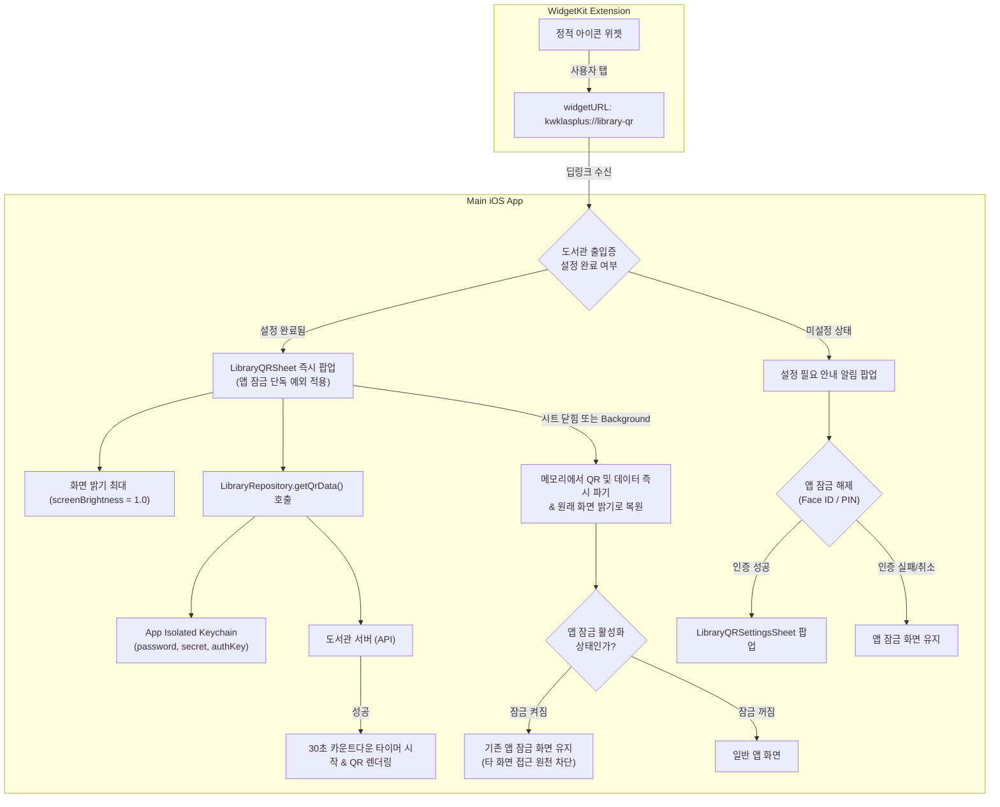

# ADR-006: iOS 도서관 출입증 QR App Group 및 WidgetKit 공유 정책

- 상태: Accepted (M7-005 정책 고정. 구현은 M7-006)
- 날짜: 2026-09-05
- 작업: M7-005

## 결정 요약

iOS 도서관 출입증 위젯은 **Android 기준 앱(`LibraryQRWidget`)과 100% 동일한 정적 아이콘 런처 방식**(`widgetURL` / Deep Link)으로 동작한다. 위젯에는 개인정보를 일절 저장하지 않는 정적 아이콘만 표시하며, 위젯 탭 시 딥링크(`kwklasplus://library-qr`)를 통해 앱을 즉시 실행하여 화면 밝기 최대(`screenBrightness = 1.0`)로 30초 최신 QR 모달을 표시한다.

또한 도서관 게이트 빠른 출입을 위해 **도서관 QR 시트에 한해 앱 잠금(PIN/Face ID) 설정의 단독 예외를 허용**(Android F-022 패리티)하며, 시트가 닫히거나 백그라운드 이동 시 표시 데이터를 즉시 파기하고 전체 앱 잠금을 안전하게 유지한다.

| 항목 | 결정 내용 | 소유 및 저장소 |
|---|---|---|
| **위젯 UI 및 실행** | Small: 도서관 출입증 정적 아이콘 버튼 개인정보 및 동적 텍스트 미포함 탭 시 `widgetURL("kwklasplus://library-qr")` | `iosApp` Widget Extension (`WidgetKit`) |
| **위젯 공유 캐시 (App Group)** | **개인정보 완전 배제 (Zero Shared PII)** 이름·학번·학과·소속 및 QR 데이터를 App Group에 저장하지 않음 | App Group 미사용 (또는 최소 설정 플래그만 한정) |
| **비밀번호 및 토큰** | 도서관 비밀번호 및 세션 토큰(`secret`, `authKey`)은 메인 앱에 격리 | `iosApp` 전용 Keychain (`IosKeychainSecureStore`) (위젯에는 절대 공유하지 않음) |
| **화면 밝기 및 갱신** | 앱 진입 시 `screenBrightness = 1.0` 설정, 30초 카운트다운 타이머 후 자동 새로고침, 닫힐 때 원래 밝기 복원 | `iosApp` SwiftUI 도서관 QR 모달 (`M7-006`) |
| **수명주기 및 메모리** | 시트 닫힘 또는 백그라운드 전환 시 표시 데이터와 QR을 메모리에서 즉시 제거하고 기존 밝기 복원 | `iosApp` SwiftUI 도서관 QR 모달 (`M7-006`) |
| **앱 잠금 상호작용 (F-022 패리티)** | **도서관 QR 시트 단독 잠금 예외 허용** - 설정 완료 시: 앱 잠금 상태와 무관하게 QR 시트 즉시 팝업 - 시트 닫힘 시: 앱 전체 잠금 상태 유지 (타 화면 접근 차단) - 미설정 시: 설정 안내 후 앱 잠금 해제를 거쳐 설정 화면 이동 | `AppLockController` + `HomeCoordinator` |
| **딥링크 스키마** | `kwklasplus://library-qr` (출입증 열기) `kwklasplus://library-qr/settings` (설정 열기 - 앱 잠금 켜짐 시 인증 필수) | `iosApp` URL Types 등록 및 라우팅 |

---

## 기술 후보군 비교 및 채택/기각 이유

### 1. 위젯 표시 및 실행 API

| 기술 후보군 | 동작 방식 | 채택 여부 | 채택 / 기각 이유 |
|---|---|---|---|
| **WidgetKit + Deep Link (`widgetURL`) (정적 아이콘 런처)** | 위젯에는 정적 아이콘만 표시, 탭 시 딥링크(`kwklasplus://library-qr`)로 앱 실행 후 즉시 QR 모달 팝업 | **채택** | 1. **Android와 100% 동일 UX**: Android 기준 앱의 `LibraryQRWidget`도 탭 시 투명 액티비티(`LibraryQRWidgetActivity`)로 바텀시트를 띄우는 정적 아이콘 런처 방식임. 2. **화면 밝기 최대 구현**: 도서관 게이트 바코드 인식에는 최대 화면 밝기(`screenBrightness = 1.0`)가 필수적이나 위젯 자체에는 밝기 제어 API가 없어 앱 화면 실행이 필수적임. 3. **상태 관리 제로화**: 위젯에 개인정보를 올리지 않으므로 타임라인 갱신 예산, 마스킹 동기화, 로그아웃 시 캐시 삭제 등의 복잡성이 원천 제거됨. |
| **WidgetKit 개인정보 카드 렌더링** | App Group에 스냅샷(이름, 학번, 학과)을 저장하여 위젯 카드에 텍스트 표시 | **기각** | 1. **불필요한 복잡도**: Android 대비 불필요한 개인정보 캐시 동기화, 잠금 시 마스킹 갱신, 로그아웃 후 데이터 제거 등 복잡한 상태 관리 부담 발생. 2. **개인정보 노출 위험**: 홈 화면에 학생 신원 정보가 상시 노출될 위험. |
| **WidgetKit Static Timeline Entry (인-위젯 QR 렌더링)** | App Group을 통해 최근 생성된 QR 이미지를 넘겨받아 위젯 뷰에 직접 그림 | **기각** | 1. **타임라인 갱신 예산 한계**: iOS WidgetKit의 타임라인 갱신 예산(하루 약 40~70회)으로는 30초마다 바뀌는 동적 QR을 실시간 유지 불가. 2. **화면 어두움으로 인한 인식 실패**: 기기 화면이 어두우면 게이트 바코드 리더기가 인식하지 못해 스캔 실패율 급증. 3. **체감상 상시 만료**: 위젯을 보는 순간 이미 30초가 지나 결국 탭해서 앱을 열어야 하므로 복잡도만 증가함. |
| **WidgetKit Interactive Widget (iOS 17+ `AppIntent`)** | 위젯 내 버튼을 눌러 앱을 열지 않고 백그라운드에서 새 QR 발급 및 타임라인 갱신 | **기각** | 1. **최소 지원 버전 불일치**: 프로젝트 최소 지원 버전은 iOS 16.0([`ADR-007`](ADR-007-min-platform-versions.md))이므로 iOS 17 전용 인터랙티브 위젯에 의존 불가. 2. **밝기 문제 미해결**: 인텐트로 QR을 갱신하더라도 위젯 화면 밝기를 올릴 수 없음. |
| **Apple Wallet (PassKit - `.pkpass`) / Live Activities** | 애플 지갑에 패스 등록 또는 다이내믹 아일랜드에 출입증 상시 표시 | **기각** | 30초 동적 QR 갱신을 위해 별도 서버 인프라/APNs 푸시가 필요하거나 배터리가 낭비되므로, 5초 내외 단발성 게이트 출입에 맞지 않는 과도한 설계. |

---

### 2. 데이터 저장 및 공유 방식

| 기술 후보군 | 동작 방식 | 채택 여부 | 채택 / 기각 이유 |
|---|---|---|---|
| **App Group 개인정보 미저장 (Zero Shared PII) + 앱 격리 Keychain** | 위젯과 개인정보/비밀번호를 일절 공유하지 않고, 도서관 자격증명과 세션키는 메인 앱 Keychain에만 보관 | **채택** | 1. **최고 수준 보안**: 개인 식별 정보와 도서관 비밀번호가 앱 샌드박스 외부(익스텐션 포함)로 일절 유출되지 않음. 2. **상태 동기화 부담 없음**: App Group 저장소가 비어있으므로 동기화 충돌, 손상, stale 캐시 문제가 원천 차단됨. |
| **App Group UserDefaults 스냅샷 캐시** | 위젯 카드 표시에 필요한 정보(학번, 이름, 학과 등)를 공유 저장소에 보관 | **기각** | 위젯을 정적 아이콘 런처로 결정함에 따라 공유 저장소에 개인정보를 보관할 이유가 완전히 소멸됨(YAGNI). |
| **App Group Shared Keychain (Keychain Access Groups)** | 앱과 위젯 익스텐션이 동일한 키체인 그룹을 공유하여 비밀번호까지 공유 | **기각** | 위젯이 백그라운드 API 통신을 하지 않으므로 비밀번호를 공유할 필요가 없고 권한 노출만 확대됨. |

---

### 3. 인증 및 앱 잠금(Face ID / PIN) 연동

| 기술 후보군 | 동작 방식 | 채택 여부 | 채택 / 기각 이유 |
|---|---|---|---|
| **도서관 QR 시트 단독 잠금 예외 허용 (Android F-022 패리티)** | 앱 잠금이 활성화되어 있어도 `library-qr` 딥링크는 인증 없이 즉시 QR 시트 팝업 | **채택** | 1. **게이트 신속 통과**: 게이트 앞에서 Face ID/PIN 입력 지연 없이 0.1초 만에 바코드 인식 가능. 2. **안전한 경계 격리**: QR 시트만 단독으로 열리며, 시트를 닫거나 타 화면으로 이동 시에는 앱 전체 잠금이 유지됨. 3. **미설정 보호**: 도서관 출입증이 미설정 상태인 경우 인증 없이 설정 화면을 열지 않고, 설정 안내 후 앱 잠금 해제를 거쳐 진입하도록 분기. |
| **위젯 실행 시에도 항상 Face ID/PIN 선인증 요구** | 앱 잠금이 켜져 있으면 위젯을 탭해도 잠금을 먼저 해제해야만 QR 시트 노출 | **기각** | 도서관 게이트 출입 시 줄 지연 및 불편을 초래하며, Android 기준 앱의 위젯 예외 동작(F-022)을 위반함. |

---

## Android 계약 → iOS 구조 및 데이터 흐름

---

## 세부 사양

### 1. 위젯 규격
- 형태: WidgetKit `StaticConfiguration` (Small 단일 사이즈 또는 아이콘 중심 Medium 지원)
- 렌더링: 광운대학교 도서관 출입증 정적 심볼/아이콘 이미지
- 딥링크 URL: `kwklasplus://library-qr`

### 2. 딥링크 라우팅 및 보안 규칙
- `kwklasplus://library-qr`:
  - 도서관 자격증명(학번, 전화번호, 비밀번호)이 설정되어 있는 경우: **앱 잠금 여부와 무관하게 도서관 QR 바텀시트를 즉시 모달로 팝업**.
  - 도서관 자격증명이 미설정된 경우: 설정 화면을 바로 열지 않고, "먼저 모바일 학생증 설정을 완료해주세요" 알림 표시 후 **앱 잠금 인증을 거쳐야만** 설정 화면으로 이동.
- `kwklasplus://library-qr/settings`:
  - 도서관 설정 바텀시트 열기 (앱 잠금 활성화 시 예외 없이 Face ID/PIN 본인 인증 필수. 앱 잠금 미사용 시에는 인증 없이 즉시 오픈).

### 3. 화면 수명주기 및 메모리 정리
- **진입 시**:
  - `UIScreen.main.brightness`를 1.0으로 설정.
  - 최신 QR 코드 조회 및 30초 카운트다운 타이머 동작.
- **퇴장 시 (`onDismiss` 또는 `scenePhase == .background`)**:
  - `screenBrightness`를 진입 전 원래 밝기로 복원.
  - 카운트다운 타이머 즉시 취소.
  - 메모리에 로드된 QR 이미지/문자열 및 개인정보(`userName`, `userCode` 등)를 `nil`로 할당하여 가비지 컬렉션/메모리 파기.
  - 앱 전체의 잠금 상태(`AppLockController`)는 그대로 잠김(`locked`) 상태를 유지.

### 4. 예외 및 Fallback 정책
- **KLAS 로그아웃 시**:
  - 도서관 설정(학번, 전화번호, 비밀번호)은 독립 유지하되, 도서관 세션 캐시(`authKey`)는 즉시 삭제.
  - 위젯에는 개인정보가 없으므로 별도의 위젯 리로드나 캐시 파기 불필요.
- **네트워크 오류 / 도서관 서버 장애**:
  - 앱 내 진입 시 안드로이드와 동일하게 `clearCache` 후 1회 자동 재시도.
  - 재시도 실패 시 "모바일 학생증 정보를 가져올 수 없습니다" 안내 후 원래 밝기로 복귀.
