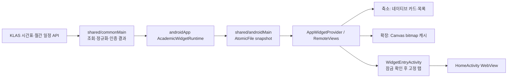

# ADR: Android 학사 시간표·캘린더 홈 화면 위젯

- 상태: 구현 기준 기록, 실기기 검증 대기
- 날짜: 2026-09-12
- 기준: `feat/android-dynamic-widget`의 `ae39263`·`1b34224` (상위 `origin/kmp` `38ea33a`)
- 범위: 학사 시간표·일정 위젯. iOS 도서관 QR 정적 위젯의 별도 정책은 [ADR-006](ADR-006-ios-library-qr-widget.md)에 기록되어 있다.

## 결정과 소유권

학사 데이터 조회·정규화·표시 정책·직렬화 계약은 `shared/commonMain`에 두고, Android 저장소 구현은 `shared/androidMain`, 홈 화면 진입점·스케줄러·RemoteViews·Canvas·앱 잠금 연결은 `androidApp/widget`에 둔다. 같은 공통 모델과 정책을 나중에 iOS WidgetKit에 재사용하되 Android의 `Context`, `AppWidgetManager`, `Activity`는 공통 코어에 노출하지 않는다. iOS 방향은 [ADR-ios-widgets](ADR-ios-widgets.md)에 별도 기록한다.

| 층 | 구현 | 책임 |
|---|---|---|
| 공통 데이터 | `TimetableRepository`, `CalendarRepository`, `KlasCalendarEventNormalizer`, `CalendarSyncUseCase` | 기존 SESSION 기반 조회, 날짜·일정 정규화, 만료·재인증·재시도 구분 |
| 공통 표시 계약 | `AcademicWidgetSnapshot`, `AcademicWidgetPolicy`, `WidgetClassPolicy`, `TimetableColorPolicy`, `WidgetDestination` | 계정/학기 스냅샷, 월간 막대·오늘 목록·수업 진행률, 8색 light/dark 배정, 고정 탭 URI |
| Android 저장 | `AndroidAcademicWidgetSnapshotStore` | `noBackupFilesDir/academic_widget_snapshot_v1.json`에 `AtomicFile` 읽기·쓰기·삭제 |
| Android 수명주기 | `AcademicWidgetRuntime`, `AcademicWidgetScheduler`, `WidgetDisplayRefresh` | 앱 시작·진입·계정/학기 변경·위젯 추가·날짜 변경·예약 조회·표시 갱신 |
| Android 표시·진입 | `AcademicWidgets`, `AcademicWidgetDrawing`, `WidgetBitmapCache`, `WidgetEntryActivity` | 크기별 RemoteViews/Canvas, bitmap 캐시, 앱 잠금 후 WebView 탭 진입 |

## 데이터와 동기화

`AcademicWidgetSnapshot`은 계정 ID의 SHA-256 식별값 `owner`, 선택 학기 `term`, 선택적 시간표·조회 시각, 현재 월 `month`, 선택적 일정·조회 시각·`READY/NEEDS_LOGIN/RETRY` 상태를 갖는다. 비밀번호나 SESSION 토큰은 저장하지 않는다. 계정이 바뀌거나 로그아웃하면 캐시를 삭제하고, 학기만 바뀌면 시간표와 해당 조회 시각만 무효화한다. 조회 중 계정·학기·월이 바뀌면 이전 결과를 버린다. 화면은 계정과 학기가 현재 값과 일치하는 스냅샷만 읽는다.

시간표는 `HomeActivity`의 현재 학기 조회 성공 시 `recordTimetable`로 저장한다. 앱이 다시 foreground로 들어오면 현재 학기의 시간표를 조회해 변동을 반영하며 별도 주기적 시간표 네트워크 작업은 없다. 시간표의 월~금 수업은 그리드에, 토·일 수업은 과목명만 중립색 하단 목록에 둔다. `TimetableColorPolicy.assign`은 정규화한 과목명과 8색 light/dark 팔레트로 첫 8과목을 서로 다른 슬롯에 결정적으로 배정한다. `TimetableWebCodec`은 동일한 light/dark 색상 쌍을 선택적 `color` 필드로 WebView에 전달한다. 구 WebView는 추가 필드를 무시하고, 구 Native payload를 받는 새 WebView는 자체 색상 계산으로 돌아간다.

캘린더는 현재 월 1일~말일을 `MySchdulMonthTableList.do`에 POST한다. 현재 SESSION으로 먼저 조회하고, 명시적 만료 시 저장 자격증명으로 재인증한 후 다시 조회한다. CAPTCHA·임시 비밀번호·잘못된 자격증명·사용자 취소는 `NEEDS_LOGIN`, 일시적 네트워크/서버 문제는 `RETRY`로 분리한다. 위젯 추가 시 `goAsync`로 즉시 조회하며 8초 내 완료하지 못하거나 재시도가 필요하면 네트워크 조건이 있는 JobScheduler 작업으로 인계한다. 앱 foreground와 위젯의 새로고침 버튼도 즉시 조회를 시작한다. 정기 작업은 캘린더 위젯이 있을 때 1시간 주기(15분 flex), 날짜 전환은 자정 이후 재렌더링과 월간 조회를 예약한다. JobScheduler 주기·백오프는 OS가 조정하므로 정확한 실행 시각은 보장하지 않는다.

정상 캐시가 있으면 실패해도 마지막 일정을 유지하고 `갱신 지연`을 표시한다. `RETRY` 상태 또는 마지막 성공 조회로부터 2시간 초과 시 이 문구가 나온다. 로그인 필요 상태는 별도로 표시한다. 오늘 일정이 비었으면 이번 달 가까운 날짜의 일정을 보여주고, 그것도 없으면 `일정 없음`으로 표시한다. 조회가 성공하면 갱신 시각을 `업데이트`로 표시한다.

## 크기·렌더링·전력

Android 호스트가 제공한 현재 방향의 dp 폭/높이로 단일 위젯 종류의 레이아웃을 선택한다. 높이 `250dp` 이상을 확장형(Nx4 이상에 대응), 그 미만을 축소형(Nx1~Nx3에 대응)으로 취급한다. 축소형 중 폭 `110dp` 미만은 시간표 집중 카드, 그 이상은 날짜/수업 목록 또는 캘린더 agenda이다. 실제 런처 셀 치수는 기기마다 달라 경계와 글자 잘림을 실기기에서 확인해야 한다.

축소형은 TextView·ProgressBar·ListView로 그린다. 현재/다음 수업의 남은 시간과 진행률은 화면이 켜져 있고 표시가 필요한 축소 시간표가 있을 때 분 단위 `TIME_TICK`/비정확 알람으로 갱신한다. 확장형은 이 분 단위 경로에서 제외한다. Canvas는 확장 시간표 그리드와 월간 달력에만 사용한다. 제공 dp 영역에 density를 적용해 bitmap을 만들되 화면 픽셀 예산의 1.2배 이내로 제한한다. 데이터·날짜·크기·테마·해상도별 `LruCache`는 조회 시각/실패 상태만 바뀐 경우 bitmap을 재사용하고, 계정 삭제 시 비운다. 따라서 확장형 재렌더가 매번 rasterize를 유발하지 않는다. 다만 프로세스 재시작·캐시 축출·날짜·데이터·테마·크기 변경에는 다시 그린다.

## 잠금·진입·실패 정책

앱 잠금 중에도 위젯 내용은 표시한다. 탭하면 내부 `WidgetEntryActivity`가 잠금 해제를 요청하고 성공·`isUnlocked`를 함께 확인한 뒤 앱을 연다. 취소·실패 시 앱 콘텐츠로 진입하지 않는다. 목적지는 정확히 `klasplus://widget/timetable` 또는 `klasplus://widget/calendar`만 허용하고 `MainActivity`/로그인 경유 시 전달해 Home WebView의 해당 탭을 연다. 기존 도서관 QR 설정 action은 이 전달 과정에서 별도로 보존하되 학사 위젯 URI를 도서관 QR 잠금 예외로 해석하지 않는다. 임의 URL/쿼리를 위젯 경로로 전달하지 않는다.

위젯 스냅샷은 앱 전용·백업 제외 저장소에 있지만 홈 화면에 학사 정보가 표시되는 것은 이 기능의 명시적 잠금 예외다. 민감한 인증 값은 스냅샷·bitmap key·로그·WebView 색상 payload에 넣지 않는다. 조회 실패 시 기존 스냅샷을 가능한 한 유지하고 상태를 표시하며, 새 provider/서비스와 JobScheduler ID `7201`~`7203`, 표시 알람 `7204`를 제거·취소하면 기능을 롤백할 수 있다. 기존 설정 키·SESSION·브리지 메서드는 변경하지 않는다.

## 검증 경계

공통 로직은 계정/학기 무효화, 주말 파싱, 월간 겹침 막대, 빈 일정·실패·재인증, 과목별 색상 중복 방지와 light/dark 대비를 테스트한다. Android JVM/소스 컴파일은 렌더링 정책·초기 조회·크기 분기와 리소스 연결을 확인한다. 실기기에서는 런처별 1~4칸 크기, 회전, 라이트/다크, 앱 잠금 성공·취소, 첫 추가·수동 갱신·오프라인·월 변경·절전·재부팅·로그아웃을 확인해야 한다. 에뮬레이터 실행과 APK 생성은 사용자 요청에 따라 이 작업에서 수행하지 않는다.
